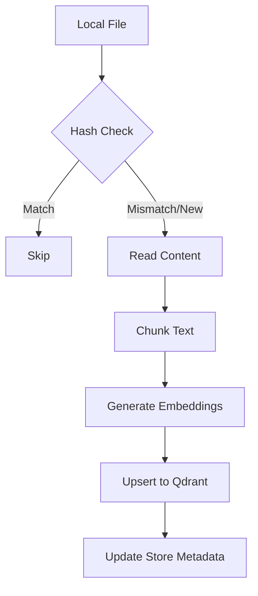
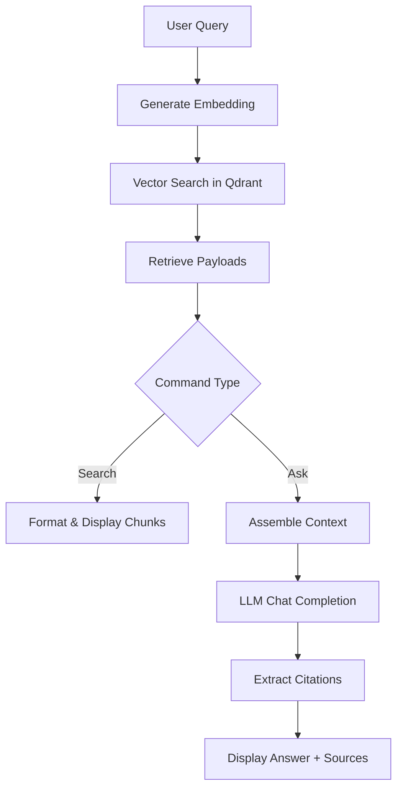

# Data Flow Analysis

## Data Models Overview

The `mgrep` application uses several key data models to manage configuration, file metadata, and search results.

- **Configuration Models**:
    - `MgrepConfig`: The root configuration object containing settings for Qdrant, Embeddings, LLM, and Sync. Validated using Zod.
    - `EmbeddingsConfig` & `LLMConfig`: Provider-specific settings (model, API key, base URL, etc.).
- **File & Metadata Models**:
    - `FileMetadata`: Contains the `path` and `hash` (SHA256) of a file.
    - `StoreFile`: Represents a file in the vector store, including its `external_id` and metadata.
- **Search & Retrieval Models**:
    - `ChunkType`: A union type for different content types: `TextChunk`, `ImageURLChunk`, `AudioURLChunk`, and `VideoURLChunk`.
    - `SearchResponse`: Contains an array of `ChunkType` results.
    - `AskResponse`: Contains a generated `answer` and the `sources` (chunks) used to generate it.
- **Persistence Models**:
    - `QdrantPayload`: The structure of data stored in Qdrant points, including `external_id`, `path`, `path_scopes` (for prefix filtering), `hash`, `content`, and chunking metadata (`start_line`, `num_lines`).

## Data Transformation Map

Data undergoes several transformations as it moves from the local file system to the vector database and back to the user.

1.  **Sync/Ingestion Transformation**:
    - **File to Buffer**: Local files are read into memory as Buffers.
    - **Buffer to Hash**: A SHA256 hash is computed for change detection.
    - **Content to Chunks**: Text content is split into overlapping chunks (default 50 lines with 10 lines overlap) in `QdrantStore.chunkText`.
    - **Chunks to Vectors**: Each chunk is sent to an embedding provider (e.g., OpenAI) to generate a high-dimensional vector.
    - **Metadata to Payload**: File paths are transformed into `path_scopes` (e.g., `/a/b/c` -> `["/", "/a", "/a/b", "/a/b/c"]`) to support hierarchical filtering.
2.  **Search Transformation**:
    - **Query to Vector**: The search string is transformed into a vector using the same embedding model.
    - **Vector to Points**: Qdrant performs a similarity search and returns points with payloads.
    - **Points to Chunks**: Payloads are mapped back to `TextChunk` or other chunk types.
3.  **RAG (Ask) Transformation**:
    - **Context Assembly**: Retrieved chunks are concatenated to form a context window.
    - **LLM Processing**: The context and question are transformed into a natural language answer.
    - **Citation Extraction**: The CLI parses `<cite i="...">` tags from the LLM response to link answers back to specific source chunks.

## Storage Interactions

- **Qdrant (Vector Database)**:
    - Acts as the primary persistent storage for embeddings and file content.
    - Uses collections (prefixed with `mgrep_`) to isolate different stores.
    - Supports payload indexing on `external_id`, `path`, and `path_scopes` for efficient filtering.
    - Uses deterministic point IDs generated from `external_id` and `chunk_index` to allow idempotent updates.
- **Local File System**:
    - Source of truth for the files being indexed.
    - Stores configuration in `.mgreprc.yaml` (local) or `~/.config/mgrep/config.yaml` (global).

## Validation Mechanisms

- **Schema Validation**: Uses `zod` in `src/lib/config.ts` to validate configuration files and environment variables.
- **File Validation**:
    - `exceedsMaxFileSize`: Skips files larger than the configured limit (default 10MB).
    - `isText`: Uses the `istextorbinary` library to ensure only text files are processed for standard indexing.
    - Empty file check: Skips files with zero bytes.
- **Data Integrity**: SHA256 hashes are used to compare local file state with the state stored in Qdrant, ensuring only modified files are re-indexed.

## State Management Analysis

- **Stateless Execution**: The CLI is largely stateless; it derives the necessary state for each command by querying the local file system and the remote Qdrant instance.
- **Remote State**: The "state" of the indexed repository is maintained in Qdrant.
- **Sync State**: During `initialSync`, the application builds a temporary map of `external_id -> hash` from the store to determine which files need to be uploaded, updated, or deleted.
- **Concurrency Control**: Uses `p-limit` to manage the number of simultaneous upload/embedding operations.

## Serialization Processes

- **YAML**: Used for reading and writing configuration files.
- **JSON**: Used for communication with the Qdrant API and LLM/Embedding providers.
- **Deterministic ID Generation**: `generatePointId` serializes the combination of `externalId` and `chunkIndex` into a UUID-compatible string using SHA256.
- **Path Scoping**: Serializes file paths into an array of parent directory strings for prefix-based filtering.

## Data Lifecycle Diagrams

### Sync Lifecycle

### Search/Ask Lifecycle
