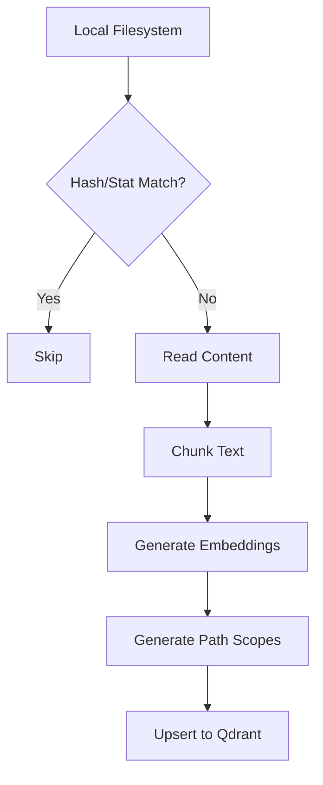
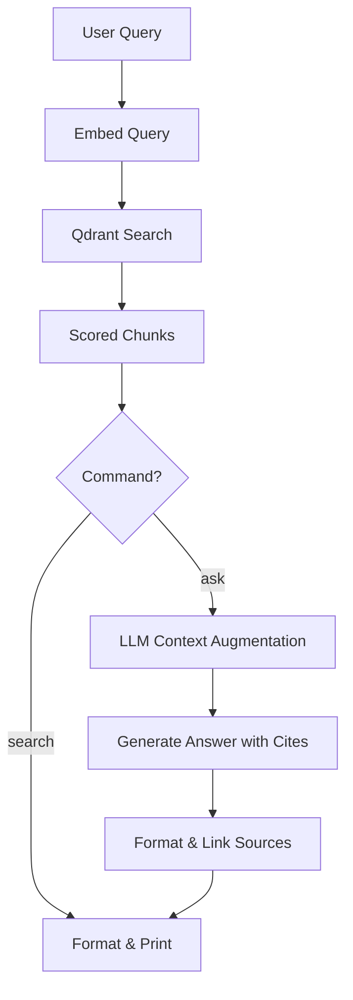

# Data Flow Analysis

## Data Models Overview

The system centers around several key data models that define how code, documentation, and metadata are represented:

- **MgrepConfig**: A structured configuration model validated using Zod. It includes settings for `qdrant`, `embeddings`, `llm`, `sync`, and `tavily`.
- **FileMetadata**: Tracks the state of a file on disk, including its absolute `path`, `hash` (SHA-256), `size`, and `mtimeMs` (modification time).
- **StoreFile**: Represents a file entry within the vector store, linking an `external_id` (usually the file path) to its `FileMetadata`.
- **Chunk Models**:
    - **BaseChunk**: Common properties like `score`, `chunk_index`, and `metadata`.
    - **TextChunk**: Contains raw `text` and line range information (`start_line`, `num_lines`).
    - **Multimedia Chunks**: `ImageURLChunk`, `AudioURLChunk`, and `VideoURLChunk` for multi-modal data.
- **QdrantPayload**: The internal schema stored in Qdrant's payload, containing `path_scopes` (for hierarchical path filtering), `content`, and indexing metadata.
- **Provider Models**:
    - **EmbeddingResult**: Contains the float array (`embedding`) and `tokenCount`.
    - **ChatMessage**: standard `role`/`content` pairs for LLM interactions.
    - **CompletionResult**: The LLM output and token usage statistics.

## Data Transformation Map

Data undergoes several transformations as it moves from the filesystem to the user:

1.  **Ingestion & Hashing**: Files are read from the filesystem; SHA-256 hashes and metadata (size/mtime) are computed to determine if a file needs re-indexing.
2.  **Chunking**: Large text files are broken down into overlapping segments (default: 50 lines per chunk with 10 lines overlap) to ensure context is preserved for vector search.
3.  **Vectorization**: Chunks of text are sent to an `EmbeddingsClient` (e.g., OpenAI, Google) which transforms strings into high-dimensional vector embeddings.
4.  **Payload Augmentation**: Metadata is enriched with "path scopes" (e.g., `/a/b/c` becomes `['/a', '/a/b', '/a/b/c']`) to allow prefix-based filtering in searches.
5.  **Search Retrieval**: User queries are transformed into vectors, which are used for cosine similarity searches against the Qdrant database.
6.  **RAG Augmentation (Ask)**: Retrieved chunks are injected into a system prompt. The LLM processes these chunks to generate a natural language answer with `<cite>` tags.
7.  **Web Search Integration**: Queries sent to Tavily return web content which is transformed into the standard `TextChunk` format, allowing web results to be treated identically to local file results.

## Storage Interactions

- **Vector Database (Qdrant)**: Acts as the primary persistence layer for indexed data. It stores both the high-dimensional vectors and the structured payload.
- **Filesystem**: 
    - **Source Data**: The application reads local source code and documents.
    - **Configuration**: Persists settings in `.mgreprc.yaml` (local) or global config directories.
- **Memory**: The `configCache` (a `Map`) stores parsed configurations to avoid redundant disk I/O during single CLI executions.
- **External APIs**: Data is sent to and received from OpenAI, Google, Anthropic, or Tavily services during the embedding, completion, and web search phases.

## Validation Mechanisms

- **Schema Validation**: Uses `zod` to enforce strict structures on configuration files (`ConfigSchema`), ensuring that provider settings and API keys are correctly formatted.
- **Data Integrity**: SHA-256 hashing verifies that the content in the vector store matches the local filesystem.
- **File Constraints**: `exceedsMaxFileSize` logic prevents the system from attempting to process or upload excessively large files (default limit: 10MB).
- **Type Checking**: Uses `istextorbinary` to skip binary files during text-based indexing operations.
- **Path Validation**: `normalize` and `resolve` are used to ensure file paths are consistent across different OS environments before being used as `external_id`s.

## State Management Analysis

The application is largely stateless between CLI invocations, relying on persistent storage to maintain context:

- **Sync State**: Managed by comparing local file metadata against the metadata stored in Qdrant's payload. The "state" of the index is the delta between these two sets.
- **CLI Options**: Commander.js manages the transient state of command-line flags (e.g., `--dry-run`, `--force`) which override the persistent configuration.
- **Concurrency Control**: `p-limit` is used to manage the state of active network requests during bulk indexing, preventing rate-limiting or socket exhaustion.
- **Progress Tracking**: The `InitialSyncProgress` object maintains the count of processed, uploaded, and deleted files during a sync operation.

## Serialization Processes

- **YAML Serialization**: Configuration files are parsed from and serialized to YAML format using the `yaml` library.
- **Vector Serialization**: Embedding vectors are handled as `number[]` arrays and serialized to JSON for transmission to Qdrant or Embedding providers.
- **UUID Generation**: Deterministic point IDs for Qdrant are generated by hashing the `external_id` and `chunk_index` and formatting them as UUID-compatible strings.
- **Citations**: In the `ask` command, citations are serialized into the LLM output as `<cite i="N">` tags, which are then parsed via Regex to link answers back to source chunks.

## Data Lifecycle Diagrams

### Ingestion & Sync Flow

### Search & Ask Flow
