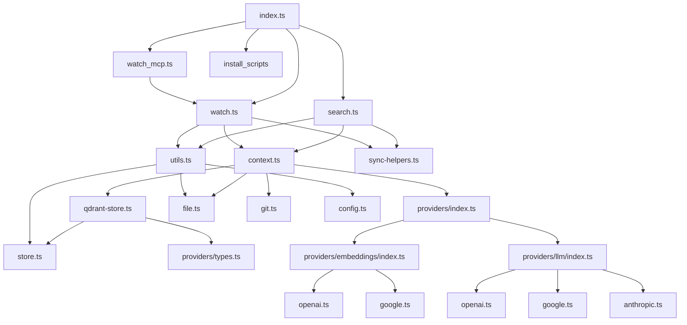

# Dependency Analysis

## Internal Dependencies Map

The `mgrep` project is structured into several layers, with a clear separation between the CLI interface, core logic, and external service providers.

### Core Layer (`src/lib/`)
- **`config.ts`**: Manages configuration loading from YAML files, environment variables, and CLI flags. Uses `zod` for validation.
- **`context.ts`**: Acts as a dependency injection container/factory. It provides methods to create `Store`, `Git`, and `FileSystem` instances, wiring them with their respective configurations.
- **`file.ts`**: Handles file system operations, including recursive file listing and hierarchical ignore pattern matching (supporting `.gitignore` and `.mgrepignore`).
- **`git.ts`**: Provides an interface to the `git` CLI for repository detection and file listing.
- **`logger.ts`**: Configures `winston` for file-based logging and overrides `console` methods to ensure all output is captured.
- **`store.ts`**: Defines the abstract `Store` interface and provides a `TestStore` implementation for testing.
- **`qdrant-store.ts`**: The primary implementation of the `Store` interface, using Qdrant as the vector database backend.
- **`sync-helpers.ts`**: UI utilities for displaying progress during file synchronization (using `ora`).
- **`utils.ts`**: Contains shared logic for file hashing, initial synchronization, and file upload/delete operations.
- **`providers/`**: A sub-layer for AI service integrations (Embeddings and LLM).
    - **`index.ts`**: Factory functions for creating embedding and LLM clients.
    - **`embeddings/`**: Implementations for OpenAI and Google embedding models.
    - **`llm/`**: Implementations for OpenAI, Google, and Anthropic LLM models.

### Command Layer (`src/commands/`)
- **`search.ts`**: Implements the main search functionality. It triggers an initial sync before performing semantic search or "ask" queries.
- **`watch.ts`**: Implements real-time file watching using `fs.watch`. It synchronizes changes to the store as they happen.
- **`watch_mcp.ts`**: Wraps the watch functionality in a Model Context Protocol (MCP) server, allowing AI agents to interact with `mgrep`.

### Installation Layer (`src/install/`)
- **`claude-code.ts`, `codex.ts`, `droid.ts`, `opencode.ts`**: Scripts for installing/uninstalling `mgrep` as a plugin for various AI coding assistants.

### Entry Point (`src/index.ts`)
- Bootstraps the CLI using `commander`, registers all commands, and initializes the logger.

---

## External Libraries Analysis

### Core Dependencies
- **`commander (^14.0.2)`**: CLI framework for command parsing and registration.
- **`@qdrant/js-client-rest (^1.9.0)`**: Official client for interacting with the Qdrant vector database.
- **`openai (^4.52.0)`**: Used for OpenAI embeddings and LLM, and also as a compatible client for Ollama.
- **`@modelcontextprotocol/sdk (^1.22.0)`**: SDK for implementing the Model Context Protocol server.

### File System & Processing
- **`ignore (^7.0.5)`**: Used for parsing and matching `.gitignore` and `.mgrepignore` patterns.
- **`istextorbinary (^9.5.0)`**: Detects if a file is text or binary to decide whether to index its content.
- **`yaml (^2.8.2)`**: Parses YAML configuration files.
- **`zod (^3.23.8)`**: Schema validation for configuration and API responses.

### User Interface
- **`ora (^5.4.1)`**: Terminal spinners for long-running operations like indexing.
- **`chalk (^5.6.2)`**: Terminal string styling.
- **`@clack/prompts (^0.11.0)`**: Interactive CLI prompts.

### Utilities
- **`p-limit (^3.1.0)`**: Limits concurrency during bulk file uploads to prevent overwhelming APIs or the local system.
- **`winston (^3.18.3)` & `winston-daily-rotate-file (^5.0.0)`**: Robust logging with file rotation.

---

## Service Integrations

### Vector Database
- **Qdrant**: The primary storage for document embeddings and metadata. `mgrep` interacts with it via the REST API client.

### AI Providers
- **OpenAI**: Integrated for both embeddings (`text-embedding-3-small` by default) and chat completions (`gpt-4o-mini` by default).
- **Google (Gemini)**: Integrated via direct `fetch` calls to the Google Generative AI API for both embeddings and LLM.
- **Anthropic (Claude)**: Integrated via direct `fetch` calls for LLM functionality.
- **Ollama**: Supported via the OpenAI-compatible client by pointing the `baseURL` to the local Ollama instance.

### Model Context Protocol (MCP)
- **MCP Server**: `mgrep` can run as an MCP server, exposing its search and watch capabilities to AI agents (like Claude Desktop or other MCP-compatible tools).

---

## Dependency Injection Patterns

### Factory Pattern
The project heavily uses the Factory pattern to decouple the creation of complex objects from their usage:
- **`createStore()`**: Instantiates the appropriate `Store` implementation (Qdrant or Test) based on the environment and configuration.
- **`createEmbeddingsClient()` / `createLLMClient()`**: Instantiates provider-specific clients based on the `provider` field in the configuration.
- **`createFileSystem()` / `createGit()`**: Provides abstraction over the local file system and git CLI.

### Interface-Based Programming
Most core components are defined by interfaces (`Store`, `FileSystem`, `Git`, `EmbeddingsClient`, `LLMClient`), allowing for easy swapping of implementations (e.g., `TestStore` for unit tests).

### Configuration Injection
Configuration is loaded centrally in `config.ts` and passed down to factories. The `context.ts` module acts as the "composition root" where these dependencies are wired together.

---

## Module Coupling Assessment

### High Cohesion
- **Provider Layer**: The `providers/` directory is highly cohesive, with clear sub-directories for embeddings and LLMs, and a unified factory.
- **Store Implementation**: `QdrantStore` encapsulates all Qdrant-specific logic, including collection management and payload indexing.

### Moderate Coupling
- **Commands to Lib**: Commands (`search`, `watch`) depend on multiple lib modules (`config`, `context`, `utils`, `store`). While expected for a CLI, some logic in `utils.ts` is specifically tailored for these commands.
- **Sync Logic**: The synchronization logic is split between `utils.ts` (the core `initialSync` function) and the commands themselves, leading to some repetition in setup code.

### Low Coupling
- **Installation Layer**: The `install/` scripts are largely independent of the core search logic, depending only on basic utilities.
- **MCP Server**: The MCP implementation is isolated in `watch_mcp.ts`, reusing the `watch` logic without deeply integrating into the core.

---

## Dependency Graph

---

## Potential Dependency Issues

### Large Utility Module
- **`utils.ts`**: This module has become a collection of various functions (hashing, syncing, uploading, environment checks). As the project grows, this could become a maintenance bottleneck.

### Duplicated Setup Logic
- Both `search.ts` and `watch.ts` perform very similar initialization steps (creating the store, loading config, running initial sync). This logic could be abstracted into a `SyncService` or similar.

### Git CLI Dependency
- The `NodeGit` implementation relies on the `git` command being available in the system's PATH. While common for developers, it's an external runtime dependency that isn't captured in `package.json`.

### Direct Fetch for Providers
- While using `fetch` for Google and Anthropic reduces the number of external libraries, it requires manual maintenance of API request/response types and error handling, which might be more robustly handled by official SDKs.

### Circular Dependency Risk
- The relationship between `context.ts`, `store.ts`, and `qdrant-store.ts` is close to being circular, though currently managed via interfaces. Care should be taken when adding new methods to these interfaces.