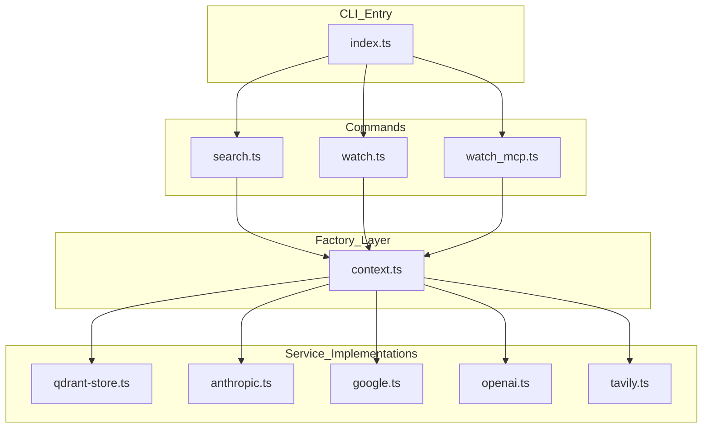

# Dependency Analysis

## Internal Dependencies Map
The `mgrep` codebase follows a structured hierarchical architecture where a central factory module manages the instantiation of core services, promoting decoupling between the CLI commands and the underlying logic.

*   **CLI Entry Point (`src/index.ts`)**: The main executable that orchestrates command registration and initializes the global logger.
*   **Commands Layer (`src/commands/`)**: Implements specific CLI actions like `search`, `watch`, and `watch_mcp`. These modules are consumers of the services provided by the `lib` directory.
*   **Context Factory (`src/lib/context.ts`)**: Serves as a lightweight DI container. It reads the user configuration and instantiates concrete implementations for the `Store`, `EmbeddingsClient`, `LLMClient`, and `WebSearchClient`.
*   **Library Core (`src/lib/`)**:
    *   `store.ts`: Defines the core `Store` interface and shared data models (e.g., `ChunkType`, `SearchResponse`, `FileMetadata`).
    *   `file.ts` & `git.ts`: Provide abstractions for file system operations and Git integration (used for `.gitignore` awareness).
    *   `config.ts`: Handles configuration loading and validation using `zod` and `yaml`.
*   **Provider Implementations (`src/lib/providers/`)**: Contains the specialized logic for interacting with external AI services, partitioned by functionality (LLM, Embeddings, Web Search).

## External Libraries Analysis
The project maintains a lean dependency profile, favoring built-in Node.js features and direct REST API calls over heavy vendor-specific SDKs where possible.

### Primary Runtime Dependencies:
| Library | Version | Purpose |
| :--- | :--- | :--- |
| `commander` | `^14.0.2` | CLI framework for argument parsing and command management. |
| `@qdrant/js-client-rest` | `^1.9.0` | Official client for the Qdrant vector database. |
| `openai` | `^4.52.0` | Client for OpenAI and Ollama-compatible embedding/chat endpoints. |
| `@modelcontextprotocol/sdk` | `^1.22.0` | Implementation of the Model Context Protocol (MCP) for AI agent integration. |
| `@clack/prompts` | `^0.11.0` | Interactive terminal UI components (spinners, input prompts). |
| `zod` | `^3.23.8` | Schema validation for configuration files and internal types. |
| `winston` | `^3.18.3` | Robust logging with file rotation support. |
| `yaml` | `^2.8.2` | Configuration file parsing. |
| `ignore` | `^7.0.5` | Logic for processing `.gitignore` patterns. |
| `istextorbinary` | `^9.5.0` | Content detection to avoid indexing binary files. |

### Build & Test Dependencies:
*   **Vitest**: Used for unit testing and code coverage.
*   **BATS**: Bash Automated Testing System for end-to-end CLI integration tests.
*   **Biome**: Used for linting and code formatting.

## Service Integrations
`mgrep` is designed to be provider-agnostic, integrating with several external AI and data services:

1.  **Vector Storage**: **Qdrant** is the primary vector database integration, supporting both local and cloud instances via the REST client.
2.  **LLM Providers**:
    *   **OpenAI / Ollama**: Integrated via the `openai` library.
    *   **Anthropic (Claude)**: Integrated via direct `fetch` calls to the Messages API, avoiding the full SDK.
    *   **Google (Gemini)**: Integrated via direct `fetch` calls to the Generative Language API.
3.  **Web Search**: **Tavily** is used for fetching real-time web context, integrated via direct REST API calls.

## Dependency Injection Patterns
The project utilizes a **Factory Pattern** to manage dependencies:

*   **Interface Abstraction**: Core components like `Store`, `LLMClient`, and `EmbeddingsClient` are defined as TypeScript interfaces. This allows different implementations to be swapped transparently.
*   **Centralized Instantiation**: The `createStore` function in `src/lib/context.ts` acts as the single point of truth for object creation. It selects the appropriate implementation (e.g., `QdrantStore` vs `TestStore`) based on the environment (test vs production) and configuration.
*   **Configuration Injection**: Dependencies are configured via a centralized `MgrepConfig` object, which is passed into the factories at runtime.

## Module Coupling Assessment
*   **Low Command-to-Provider Coupling**: CLI commands do not import concrete provider classes (like `AnthropicLLM`). They only know about the `Store` or `LLMClient` interfaces.
*   **Cohesive Providers**: Each provider (Anthropic, Google, etc.) is isolated in its own file, ensuring that changes to one provider's API do not affect others.
*   **Context as a Liaison**: `src/lib/context.ts` is the only module with high coupling to all concrete implementations, which is the intended design for a centralized factory.
*   **Testability**: The use of a `TestStore` implementation allows integration tests to run without requiring a live Qdrant instance, demonstrating effective decoupling through the `Store` interface.

## Dependency Graph

## Potential Dependency Issues
*   **Maintenance of Custom API Clients**: By using direct `fetch` calls for Anthropic and Google Gemini instead of their official SDKs, the project must manually maintain these integrations if the service providers make breaking changes to their REST APIs.
*   **Single Production Store**: Currently, `QdrantStore` is the only non-test implementation of the `Store` interface. While the architecture supports other vector databases, adding one would require extending the `context.ts` factory and adding new configuration schemas.
*   **Synchronous Config Loading**: Configuration is loaded synchronously in some parts of the lifecycle, which is acceptable for a CLI tool but could be a bottleneck if configuration sources were to become remote or extremely large.