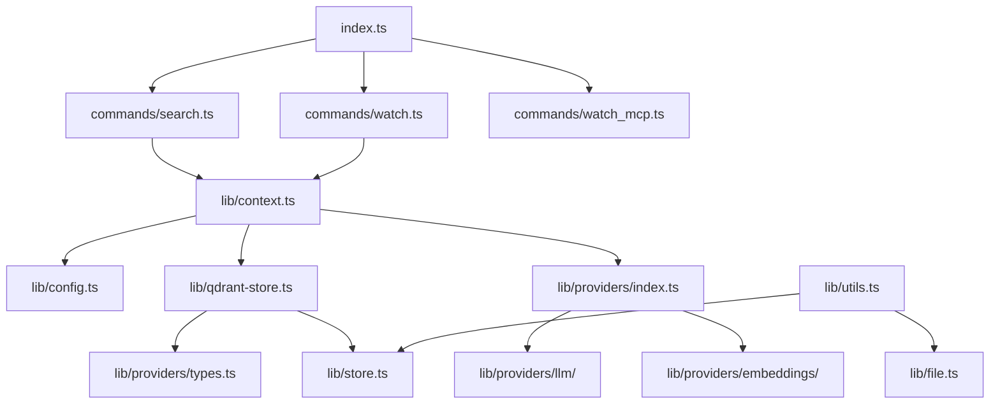

# Dependency Analysis

## Internal Dependencies

The application follows a layered architecture where the entry point delegates to command modules, which in turn use a library of core services and abstractions.

- **Entry Point (`src/index.ts`)**: Orchestrates the CLI using `commander` and routes tasks to specific command modules.
- **Command Layer (`src/commands/`)**:
    - `search.ts`, `watch.ts`, `watch_mcp.ts`: These modules implement the business logic for specific CLI actions.
    - They depend on `src/lib/context.js` for dependency resolution and `src/lib/store.js` for data access interfaces.
- **Service Layer (`src/lib/`)**:
    - `context.ts`: Acts as a Service Locator/Factory. It instantiates concrete implementations of stores, file systems, and AI clients.
    - `config.ts`: Handles configuration loading, validation (via `zod`), and environment variable parsing.
    - `store.ts`: Defines the core `Store` interface and provides a `TestStore` for development/testing.
    - `qdrant-store.ts`: A concrete implementation of the `Store` interface using the Qdrant vector database.
    - `utils.ts` & `sync-helpers.ts`: Provide shared utilities for file hashing, syncing logic, and progress tracking.
    - `file.ts` & `git.ts`: Abstractions for file system operations and Git ignore pattern handling.
- **Provider Layer (`src/lib/providers/`)**:
    - Abstracted AI service integrations for LLMs, Embeddings, and Web Search.
    - `embeddings/` & `llm/`: Support multiple backends (OpenAI, Anthropic, Google, Ollama).
    - `web/`: Integration with the Tavily search API.

## External Dependencies

The project leverages several key libraries for its functionality:

- **Vector Database**: `@qdrant/js-client-rest` for semantic data storage and retrieval.
- **AI Clients**: `openai` (used for OpenAI and Ollama compatibility).
- **CLI & UX**: 
    - `commander`: Command-line argument parsing and routing.
    - `chalk` & `ora`: Terminal styling and progress spinners.
    - `@clack/prompts`: Interactive CLI prompts.
- **Validation & Parsing**:
    - `zod`: Schema validation for configurations.
    - `yaml`: Parsing for `.mgreprc.yaml` files.
- **System & File Utilities**:
    - `ignore`: Support for `.gitignore` files.
    - `istextorbinary`: Identification of searchable file types.
    - `p-limit`: Concurrency management for bulk file processing.
- **Communication Protocol**: `@modelcontextprotocol/sdk` for exposing functionality as an MCP server.
- **Logging**: `winston` and `winston-daily-rotate-file` for robust application logging.

## Dependency Graph

The dependency flow is primarily unidirectional from the entry point down to the infrastructure layer:

## Dependency Injection

The application uses a **Factory/Service Locator** pattern centered in `src/lib/context.ts`.

- **Decoupling via Interfaces**: The core logic depends on the `Store`, `EmbeddingsClient`, and `LLMClient` interfaces rather than concrete implementations.
- **Dynamic Instantiation**: `createStore()` and `createLLMClient()` determine which implementation to instantiate at runtime based on the user's configuration file or environment variables.
- **Constructor Injection**: `QdrantStore` receives its dependencies (`embeddingsClient`, `llmClient`) through its constructor, facilitating easier testing and implementation swapping.
- **Test Doubles**: The `isTest` flag in `context.ts` allows the application to automatically swap the heavy `QdrantStore` for a lightweight `TestStore` during unit and integration tests.

## Potential Issues

- **Singleton-like Config Cache**: `src/lib/config.ts` maintains a module-level `configCache`. While efficient, it might lead to state leakage between tests if the environment isn't properly reset.
- **Platform Coupling**: Several modules rely on `process.cwd()` for configuration discovery and file path resolution, which might cause inconsistent behavior if the tool is executed from different directories.
- **Tight Coupling in Context**: `src/lib/context.ts` imports all concrete implementations (Qdrant, OpenAI, etc.). While it hides this from the rest of the app, this file becomes a central point of change whenever a new provider or store type is added.
- **Sync Logic Complexity**: `src/lib/utils.ts` contains significant business logic for syncing. This creates a tight coupling between file system abstractions, hashing logic, and the Store interface.