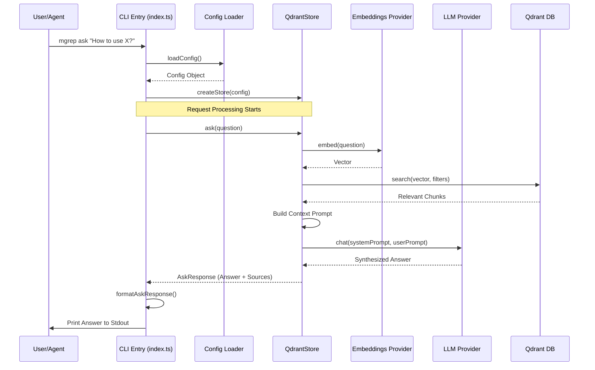

# Request Flow Analysis

This document maps the complete journey of requests through the `mgrep` system, from initial CLI invocation or MCP request to the final response.

## Entry Points Overview

The application provides two primary entry points:

1.  **CLI Entry Point (`src/index.ts`)**: The main entry point for users interacting with the tool via the command line. It uses the `commander` library to define and parse commands.
2.  **MCP Entry Point (`src/commands/watch_mcp.ts`)**: An entry point for the Model Context Protocol (MCP), allowing the tool to act as a server for AI agents (like Claude Desktop). It uses `@modelcontextprotocol/sdk`.

## Request Routing Map

Routing is handled differently depending on the entry point:

*   **CLI Routing**: `commander` routes the command-line arguments to specific command handlers:
    *   `search` (Default): Routes to `src/commands/search.ts`.
    *   `watch`: Routes to `src/commands/watch.ts`.
    *   `mcp`: Routes to `src/commands/watch_mcp.ts`.
    *   `install-*` / `uninstall-*`: Routes to scripts in `src/install/`.
*   **MCP Routing**: The `watchMcp` command sets up a `StdioServerTransport` and routes MCP requests via `server.setRequestHandler`:
    *   `notifications/initialized`: Handled internally by the SDK.
    *   `tools/list`: Returns available tools (currently empty).
    *   `tools/call`: Executes specific tool logic (currently returns "Not implemented").

## Middleware Pipeline

The "middleware" in this CLI application consists of a sequence of initialization steps that prepare the environment for request processing:

1.  **Logger Initialization**: `setupLogger()` is called immediately in `index.ts`.
2.  **Configuration Loading**: `loadConfig()` in `src/lib/config.ts` aggregates configuration from:
    *   Hardcoded defaults.
    *   Global config (`~/.config/mgrep/config.yaml`).
    *   Local config (`.mgreprc.yaml`).
    *   Environment variables (`MGREP_*`).
    *   CLI flags (overriding all the above).
3.  **Context Creation**: `createStore()` in `src/lib/context.ts` acts as a factory that:
    *   Initializes the **Embeddings Provider** (OpenAI, Google, etc.).
    *   Initializes the **LLM Provider** (OpenAI, Anthropic, etc.).
    *   Initializes the **Store Implementation** (typically `QdrantStore`).
4.  **FileSystem Initialization**: `createFileSystem()` initializes the file system abstraction with ignore patterns (including `.gitignore` and `.mgrepignore`).

## Controller/Handler Analysis

The core logic resides in the command action handlers and the `Store` implementation:

*   **Search Handler (`src/commands/search.ts`)**:
    *   Optionally triggers a `syncFiles` operation.
    *   Calls `store.search()` for pattern matching or `store.ask()` for RAG-based questions.
    *   Formats the `SearchResponse` or `AskResponse` for terminal output.
*   **Watch Handler (`src/commands/watch.ts`)**:
    *   Performs an `initialSync()` to align the remote store with the local file system.
    *   Sets up a recursive `fs.watch()` to monitor real-time changes.
    *   Dispatches `uploadFile` or `deleteFile` tasks on file events.
*   **Store Controller (`src/lib/qdrant-store.ts`)**:
    *   **`uploadFile`**: Chunks text, generates embeddings via the provider, and upserts to Qdrant.
    *   **`search`**: Embeds the query, performs vector search in Qdrant, and applies path filters.
    *   **`ask`**: Executes a search, constructs a prompt with the retrieved context, and calls the LLM for a synthesized answer.

## Authentication & Authorization Flow

As a local CLI tool, `mgrep` does not implement user-level authentication. Instead, it manages authorization to external services:

1.  **Provider API Keys**: Keys for OpenAI, Anthropic, Google, and Qdrant are retrieved during the **Middleware Pipeline** (Config Loading).
2.  **Credential Propagation**: These keys are passed to the respective provider clients (`OpenAILLM`, `GoogleEmbeddings`, etc.) during initialization in `context.ts`.
3.  **Request Signing**: The provider SDKs (e.g., `openai` npm package) use these keys to sign outgoing HTTP requests to the respective APIs.

## Error Handling Pathways

Error handling is implemented at multiple levels:

*   **CLI Validation**: `commander` catches missing arguments or invalid flags before the handler is executed.
*   **Action-Level Catch**: Every command action is wrapped in a `try-catch` block that logs the error to `stderr` and sets a non-zero `process.exitCode`.
*   **Sync Error Tracking**: `initialSync` in `src/lib/utils.ts` catches errors for individual file operations, increments an error counter, and continues processing other files.
*   **Provider Retries**: The LLM and Embedding providers are configured with `maxRetries` (defaulting to 3) to handle transient network or API errors.
*   **MCP Error Logging**: In MCP mode, `console.log/error` are redirected to `stderr` to avoid corrupting the JSON-RPC stream on `stdout`.

## Request Lifecycle Diagram

