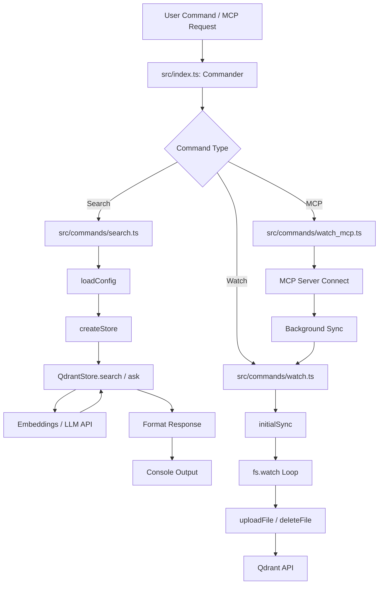

# Request Flow Analysis

## Entry Points Overview

The `mgrep` application is a CLI-based tool, and its entry points are defined by the command-line interface. The primary entry point is `src/index.ts`, which uses the `commander` library to define and dispatch commands.

*   **CLI Commands**:
    *   `search` (Default): The main entry point for searching files.
    *   `watch`: Starts a file watcher to sync local changes to the vector store.
    *   `mcp`: Starts a Model Context Protocol (MCP) server, enabling integration with AI agents.
    *   `install-*` / `uninstall-*`: Installation scripts for various platforms (Claude Code, Codex, Droid, OpenCode).
*   **MCP Server**: When running in `mcp` mode, the system acts as a server responding to JSON-RPC requests over `stdio`.
*   **File System Events**: In `watch` mode, the system reacts to local file system changes (create, modify, delete) as external triggers.

## Request Routing Map

Routing is handled by `commander` in `src/index.ts`, which maps CLI arguments to specific command handlers.

1.  **Command Dispatch**: `program.parse()` evaluates `process.argv` and routes to the corresponding `.action()` handler.
2.  **Search Routing**:
    *   `mgrep search <pattern>` -> `src/commands/search.ts`
    *   If `--answer` is present -> `store.ask()`
    *   Otherwise -> `store.search()`
3.  **Watch Routing**:
    *   `mgrep watch` -> `src/commands/watch.ts` -> `startWatch()`
4.  **MCP Routing**:
    *   `mgrep mcp` -> `src/commands/watch_mcp.ts` -> `server.connect(transport)`
5.  **Installation Routing**:
    *   `mgrep install-claude-code` -> `src/install/claude-code.ts` -> `installPlugin()`

## Middleware Pipeline

While not a traditional HTTP middleware stack, `mgrep` employs a series of preprocessing steps and abstractions that function similarly:

1.  **Logger Setup (`setupLogger`)**: Intercepts `console` methods to provide unified logging and file rotation via `winston`.
2.  **Configuration Loading (`loadConfig`)**: A multi-stage pipeline that merges:
    *   Default hardcoded values.
    *   Global config (`~/.config/mgrep/config.yaml`).
    *   Local config (`.mgreprc.yaml`).
    *   Environment variables (`MGREP_*`).
    *   CLI options.
3.  **Context Initialization (`createStore`)**: Initializes the storage backend (Qdrant) and provider clients (Embeddings, LLM) based on the loaded configuration.
4.  **File System Abstraction (`createFileSystem`)**: Wraps file operations and handles `.mgrepignore` logic.
5.  **Syncing Logic (`initialSync`)**: A preprocessing step for `search` (if `--sync` is used) and `watch` that reconciles local files with the remote store.

## Controller/Handler Analysis

The core logic resides in command handlers and the `Store` implementation.

*   **Search Handler (`src/commands/search.ts`)**:
    *   Validates input arguments and options.
    *   Triggers optional synchronization.
    *   Calls the store's search or ask methods.
    *   Formats the raw results into human-readable output (with citations if answering).
*   **Watch Handler (`src/commands/watch.ts`)**:
    *   Performs an initial full sync.
    *   Sets up a recursive `fs.watch` loop.
    *   Handles incremental updates (uploading changed files, deleting removed ones).
*   **MCP Handler (`src/commands/watch_mcp.ts`)**:
    *   Implements the MCP SDK server.
    *   Redirects standard output to `stderr` to preserve the `stdout` communication channel.
    *   Triggers background syncing.
*   **Store Handler (`src/lib/qdrant-store.ts`)**:
    *   **`search()`**: Embeds the query, applies path filters, and executes vector search in Qdrant.
    *   **`ask()`**: Executes a search, constructs a prompt with retrieved context, and calls the LLM for a natural language response.
    *   **`uploadFile()`**: Chunks text, generates embeddings, and upserts points to Qdrant.

## Authentication & Authorization Flow

Authentication is handled at the provider level through API keys.

1.  **Credential Retrieval**: API keys for Qdrant, OpenAI, Anthropic, or Google are retrieved during the `loadConfig` phase.
2.  **Client Injection**: Keys are passed into the constructors of `QdrantClient`, `OpenAIEmbeddings`, `AnthropicLLM`, etc.
3.  **Request Authorization**: Each outgoing request to external services (Vector DB or AI APIs) includes the required authorization headers (e.g., `api-key` or `Authorization: Bearer ...`).
4.  **Local Access**: No user-level authorization is implemented for the CLI itself; it operates with the permissions of the user executing the process.

## Error Handling Pathways

1.  **Global Catch-All**: Each command action is wrapped in a `try-catch` block that logs the error and sets `process.exitCode = 1`.
2.  **Logger Interception**: Errors logged via `console.error` are captured by `winston` and written to the log directory (e.g., `~/.local/state/mgrep/logs`).
3.  **Sync Resilience**: During `initialSync`, individual file failures are caught and counted, allowing the overall process to continue.
4.  **Validation Errors**: `zod` is used in `src/lib/config.ts` to catch and report configuration schema mismatches early.
5.  **CLI Argument Validation**: `commander` handles basic argument type checking and missing required arguments.

## Request Lifecycle Diagram

