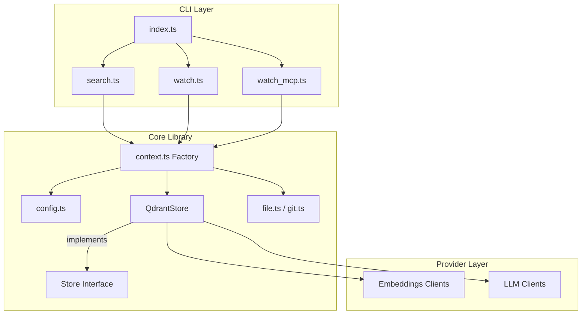
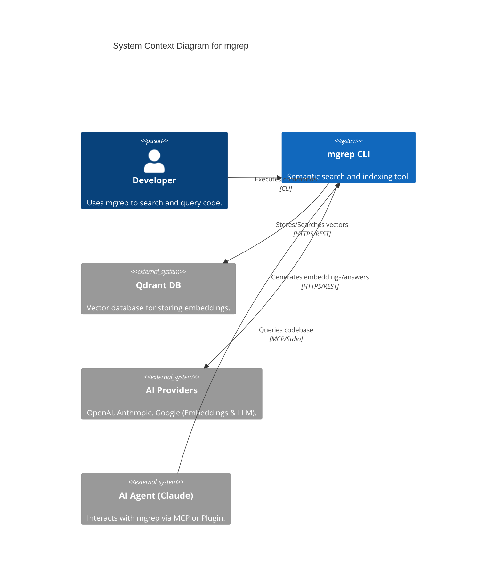
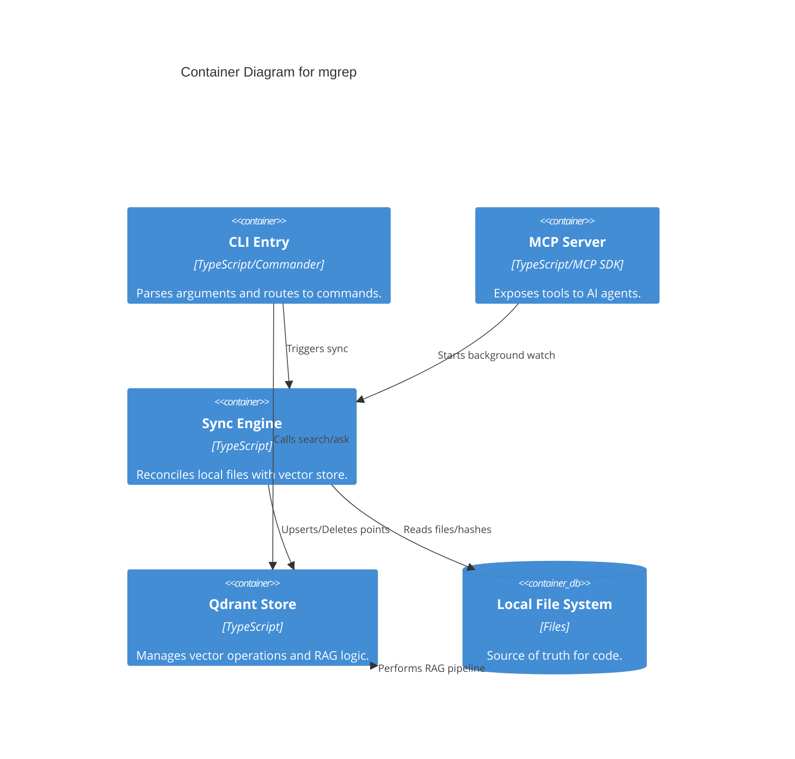

# mgrep

## Project Overview
**mgrep** is a powerful semantic search tool designed for local codebases and seamless integration with AI agents. Unlike traditional grep which relies on literal string matching or regular expressions, `mgrep` leverages vector embeddings to understand the semantic meaning of your code, allowing for natural language queries and intelligent question-answering (RAG).

### Purpose and Main Functionality
The primary purpose of `mgrep` is to bridge the gap between local source code and AI-driven development workflows. It indexes your files into a vector database (Qdrant) and provides a suite of tools to search, monitor, and query your codebase using natural language.

### Key Features and Capabilities
- **Semantic Search**: Find code based on meaning and intent rather than just keywords.
- **RAG (Retrieval-Augmented Generation)**: Ask questions about your codebase and receive AI-generated answers with direct citations to source files.
- **Real-time Synchronization**: A background "watch" mode that monitors file changes and updates the vector store incrementally.
- **AI Agent Integration**: Built-in support for the **Model Context Protocol (MCP)** and a dedicated **Claude Plugin**, enabling tools like Claude Desktop to "see" and search your code.
- **Multi-Provider Support**: Compatible with OpenAI, Google Gemini, Anthropic, and local models via Ollama.
- **Smart Filtering**: Respects `.gitignore` and `.mgrepignore` patterns and handles large files gracefully.

### Likely Intended Use Cases
- **Developer Onboarding**: Quickly understanding a new or complex codebase by asking natural language questions.
- **Code Discovery**: Finding relevant functions or logic across large repositories without knowing exact names.
- **AI-Assisted Coding**: Providing AI agents with the context they need to provide accurate code suggestions or bug fixes.

## Table of Contents
- [Project Overview](#project-overview)
- [Architecture](#architecture)
- [C4 Model Architecture](#c4-model-architecture)
- [Repository Structure](#repository-structure)
- [Dependencies and Integration](#dependencies-and-integration)
- [API Documentation](#api-documentation)
- [Development Notes](#development-notes)
- [Known Issues and Limitations](#known-issues-and-limitations)
- [Additional Documentation](#additional-documentation)

## Architecture

### High-Level Architecture Overview
`mgrep` follows a **Sync-on-Demand** architectural pattern. It reconciles the state of the local file system with a remote or local vector database (Qdrant). The system is layered to separate CLI concerns from core business logic and external AI provider integrations.

### Technology Stack and Frameworks
- **Runtime**: Node.js (TypeScript)
- **CLI Framework**: `commander`
- **Vector Database**: Qdrant (via REST API)
- **AI Providers**: OpenAI, Anthropic, Google Generative AI, Ollama
- **Validation**: `zod`
- **Logging**: `winston`
- **Protocols**: Model Context Protocol (MCP)

### Component Relationships
The following diagram illustrates how the CLI commands interact with the core library and external services:

### Key Design Patterns
- **Strategy Pattern**: Used for `Store`, `EmbeddingsClient`, and `LLMClient` to support multiple backends and AI vendors interchangeably.
- **Factory Pattern**: Centralized in `src/lib/context.ts` to manage dependency injection and instantiation based on configuration.
- **Adapter Pattern**: Used in `NodeFileSystem` and `NodeGit` to wrap standard Node.js and CLI tools into internal interfaces.

## C4 Model Architecture

Context Diagram

Container Diagram

## Repository Structure
- `src/index.ts`: Main CLI entry point.
- `src/commands/`: Implementation of CLI commands (`search`, `watch`, `mcp`).
- `src/lib/`: Core logic including configuration, file system abstractions, and the Qdrant store.
- `src/lib/providers/`: AI provider implementations (OpenAI, Google, Anthropic).
- `plugins/`: Integration plugins (e.g., Claude plugin).
- `src/install/`: Scripts for system-level integration.

## Dependencies and Integration
### Internal and External Service Dependencies
- **Qdrant**: Required as the vector database. It can be hosted locally or in the cloud.
- **AI Providers**:
    - **OpenAI**: Used for embeddings and LLM completions.
    - **Google AI (Gemini)**: Supported for embeddings and LLM.
    - **Anthropic (Claude)**: Supported for LLM (answering queries).
    - **Ollama**: Supported for local execution via OpenAI-compatible endpoints.
- **Model Context Protocol (MCP)**: Enables integration with AI agents like Claude Desktop.

## API Documentation

### CLI Interface
| Command | Description | Key Options |
| :--- | :--- | :--- |
| `search <pattern>` | Semantic search over indexed files. | `-a` (Ask/RAG), `-c` (Show content), `-s` (Sync first) |
| `watch` | Starts background file synchronization. | `-d` (Dry run) |
| `mcp` | Starts the MCP server for AI agents. | N/A |

### MCP Server
- **Transport**: Standard Input/Output (Stdio).
- **Tools**: Currently provides a skeleton for tool definitions (e.g., semantic search tools for agents).
- **Behavior**: Automatically initializes a file watcher upon startup.

### Configuration
Configuration is managed via `.mgreprc.yaml` (local) or `~/.config/mgrep/config.yaml` (global).
- **Environment Variables**: `MGREP_QDRANT_API_KEY`, `MGREP_OPENAI_API_KEY`, `MGREP_ANTHROPIC_API_KEY`, `MGREP_GOOGLE_API_KEY`.

## Development Notes
- **Project Conventions**: Uses `zod` for strict configuration validation and `winston` for structured logging.
- **Performance Considerations**:
    - Uses `p-limit` for concurrency control during indexing (default: 20).
    - Implements file size limits (default: 10MB) and binary file detection.
    - Uses SHA256 hashing for idempotent updates and change detection.
- **Testing**: Includes a `TestStore` implementation for internal logic verification without requiring a live Qdrant instance.

## Known Issues and Limitations
- **MCP Tools**: The MCP tool implementation is currently a skeleton; full tool definitions for agents are in progress.
- **Synchronous I/O**: Some file system operations in `NodeFileSystem` use synchronous calls, which may impact performance on extremely large repositories.
- **Store Hard-coding**: The `createStore` factory is currently biased towards `QdrantStore`, making it the primary supported production backend.

## Additional Documentation
- [CLAUDE.md](CLAUDE.md) - Integration and development notes for Claude.
- [SKILL.md](SKILL.md) - Documentation for the `mgrep` skill used by AI agents.
- [AGENTS.md](AGENTS.md) - Guidelines for AI agents interacting with the codebase.
- [Usage Guides](guides/README.md) - Detailed usage instructions and examples.
