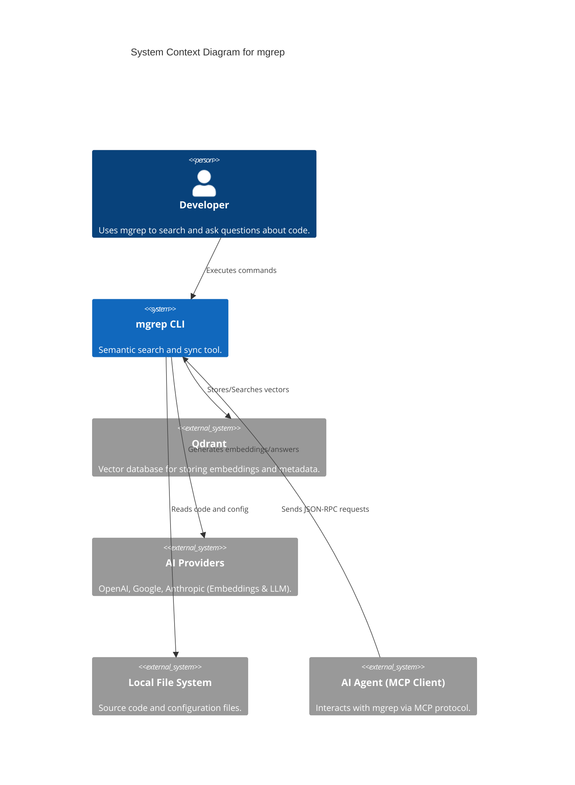
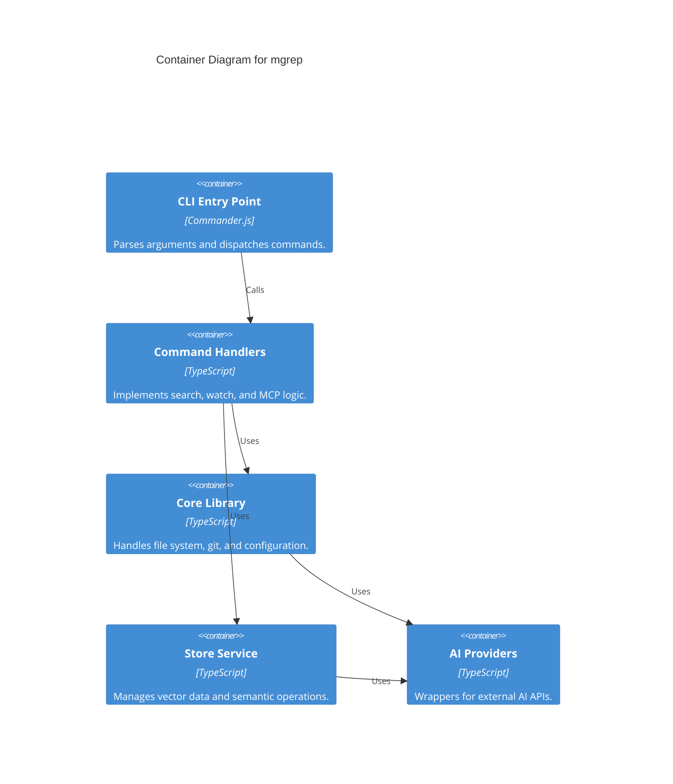

# mgrep

## Project Overview
`mgrep` is a powerful, semantic grep-like search tool designed for modern code repositories. Unlike traditional grep that relies on literal string matching or regular expressions, `mgrep` leverages vector embeddings and Large Language Models (LLMs) to understand the meaning and context of your code. It enables developers and AI agents to perform natural language searches and ask complex questions about a codebase.

### Purpose and Main Functionality
The primary goal of `mgrep` is to bridge the gap between raw source code and semantic understanding. It synchronizes local files with a vector database (Qdrant), allowing for high-speed similarity searches and Retrieval-Augmented Generation (RAG) to provide accurate, context-aware answers to technical queries.

### Key Features and Capabilities
- **Semantic Search**: Find code based on intent and functionality rather than just keywords.
- **AI-Generated Answers (RAG)**: Ask natural language questions about your codebase and receive synthesized answers with citations.
- **Real-time Synchronization**: A background "watch" mode that keeps your vector store in sync with local file changes.
- **Multi-Provider Support**: Integration with OpenAI, Google (Gemini), Anthropic (Claude), and local models via Ollama.
- **Model Context Protocol (MCP)**: Built-in MCP server support, allowing AI agents like Claude Desktop to interact seamlessly with your repository.
- **Intelligent Filtering**: Respects `.gitignore` and `.mgrepignore` patterns to ensure only relevant code is indexed.

### Likely Intended Use Cases
- **Developer Onboarding**: Quickly understanding a new codebase by asking questions like "How is authentication handled?"
- **Code Discovery**: Finding relevant functions or patterns across large, unfamiliar repositories.
- **AI Agent Tooling**: Providing AI coding assistants with a semantic interface to explore and understand local files.
- **Documentation Retrieval**: Using the codebase as a live knowledge base.

## Table of Contents
- [Project Overview](#project-overview)
- [Architecture](#architecture)
- [C4 Model Architecture](#c4-model-architecture)
- [Repository Structure](#repository-structure)
- [Dependencies and Integration](#dependencies-and-integration)
- [API Documentation](#api-documentation)
- [Development Notes](#development-notes)
- [Known Issues and Limitations](#known-issues-and-limitations)
- [Additional Documentation](#additional-documentation)

## Architecture

`mgrep` follows a modular, layered architecture designed for flexibility and extensibility. It abstracts the underlying storage and AI providers through well-defined interfaces.

### High-Level Architecture Overview
The system is divided into four main layers:
1.  **CLI Layer**: Handles user input and command dispatching.
2.  **Service Layer**: Orchestrates high-level logic like file synchronization and search workflows.
3.  **Abstraction Layer**: Defines vendor-neutral interfaces for `Store`, `EmbeddingsClient`, and `LLMClient`.
4.  **Provider Layer**: Implements specific integrations for external services (e.g., Qdrant, OpenAI).

### Technology Stack and Frameworks
- **Language**: TypeScript / Node.js
- **CLI Framework**: `commander`
- **Vector Database**: Qdrant
- **AI Providers**: OpenAI, Google Generative AI, Anthropic
- **Validation**: `zod`
- **Logging**: `winston`
- **Utilities**: `ora` (spinners), `chalk` (styling), `ignore` (pattern matching)

### Component Relationships

```mermaid
graph TD
    subgraph CLI_Layer [CLI Layer]
        Index[index.ts]
        SearchCmd[search.ts]
        WatchCmd[watch.ts]
        MCPCmd[watch_mcp.ts]
    end

    subgraph Service_Layer [Service Layer]
        Context[context.ts Factory]
        SyncHelpers[sync-helpers.ts]
        Utils[utils.ts]
    end

    subgraph Abstraction_Layer [Abstraction Layer]
        StoreInterface[Store Interface]
        AIInterfaces[AI Provider Interfaces]
    end

    subgraph Provider_Layer [Provider Layer]
        QdrantStore[QdrantStore]
        Embeddings[Embeddings Providers]
        LLM[LLM Providers]
    end

    Index --> SearchCmd
    Index --> WatchCmd
    Index --> MCPCmd

    SearchCmd --> Context
    WatchCmd --> Context
    MCPCmd --> WatchCmd

    Context --> StoreInterface
    StoreInterface <|-- QdrantStore
    QdrantStore --> AIInterfaces
    AIInterfaces <|-- Embeddings
    AIInterfaces <|-- LLM
    
    style CLI_Layer fill:#f9f,stroke:#333,stroke-width:2px
    style Service_Layer fill:#bbf,stroke:#333,stroke-width:2px
    style Provider_Layer fill:#bfb,stroke:#333,stroke-width:2px
```

### Key Design Patterns
- **Factory Pattern**: Centralized object creation in `context.ts` to wire dependencies based on configuration.
- **Strategy Pattern**: Interchangeable AI and storage providers.
- **Repository Pattern**: The `Store` interface abstracts vector database operations.
- **Dependency Injection**: Services receive their dependencies (like Git or FileSystem) through constructors.

## C4 Model Architecture

<details>
<summary>Context Diagram</summary>


</details>

<details>
<summary>Container Diagram</summary>


</details>

## Repository Structure

- **`src/index.ts`**: Main entry point and CLI command registration.
- **`src/commands/`**: Implementation of CLI commands (`search`, `watch`, `mcp`).
- **`src/lib/`**: Core business logic.
    - `store.ts` & `qdrant-store.ts`: Vector storage abstractions and Qdrant implementation.
    - `providers/`: AI service integrations (Embeddings and LLM).
    - `config.ts`: Hierarchical configuration management.
    - `file.ts` & `git.ts`: File system and Git abstractions.
- **`src/install/`**: Scripts for integrating `mgrep` with AI coding assistants.
- **`plugins/`**: Configuration and scripts for specific AI agent plugins (e.g., Claude).

## Dependencies and Integration

### Internal Service Dependencies
- **`QdrantStore`**: Depends on `EmbeddingsClient` for indexing and `LLMClient` for the "ask" functionality.
- **`FileSystem`**: Integrates with `Git` to identify tracked files and respect ignore rules.
- **`Context`**: Acts as the composition root, wiring all internal services together.

### External Service Dependencies
- **Qdrant**: Required for vector storage and similarity search.
- **AI Providers**:
    - **OpenAI**: Default provider for embeddings and LLM.
    - **Google AI**: Alternative provider for embeddings and LLM.
    - **Anthropic**: Provider for LLM (Claude).
    - **Ollama**: Local alternative for OpenAI-compatible APIs.

### Integration Protocols
- **Model Context Protocol (MCP)**: `mgrep` acts as an MCP server to expose its capabilities to AI agents via standard input/output.

## API Documentation

### CLI Interface

| Command | Description | Key Options |
| :--- | :--- | :--- |
| `mgrep search <query>` | Performs semantic search. | `-s` (sync), `-c` (show content), `-m` (max results) |
| `mgrep -a <question>` | Answers questions using RAG. | `--no-rerank` |
| `mgrep watch` | Starts real-time file syncing. | `-d` (dry run) |
| `mgrep mcp` | Starts the MCP server. | N/A |

### Configuration
`mgrep` uses a hierarchical configuration system:
1.  CLI Flags
2.  Environment Variables (e.g., `MGREP_OPENAI_API_KEY`)
3.  Local Config: `.mgreprc.yaml`
4.  Global Config: `~/.config/mgrep/config.yaml`

## Development Notes

### Project-Specific Conventions
- **Validation**: All configuration and external data should be validated using `zod` schemas.
- **Logging**: Use the centralized logger in `src/lib/logger.ts` instead of direct `console.log` to ensure output is captured in log files.
- **Interfaces**: Define new services using interfaces in `src/lib/` to maintain the provider-based abstraction.

### Performance Considerations
- **Concurrency**: File synchronization uses `p-limit` to control concurrent API requests (default: 20).
- **Batching**: Embeddings are generated in batches (default: 100) to optimize network usage.
- **Chunking**: Files are split into overlapping 50-line chunks to balance context and granularity.

## Known Issues and Limitations
- **Large Utility Module**: `src/lib/utils.ts` contains a mix of responsibilities that could be further modularized.
- **Git Dependency**: Requires the `git` CLI to be installed and available in the system PATH.
- **Setup Duplication**: Initialization logic is currently duplicated across several command handlers.
- **Direct Fetch**: Some AI providers are implemented using direct `fetch` calls rather than official SDKs, requiring manual maintenance of types.

## Additional Documentation
- [Development Roadmap](PLAN.md)
- [Claude Integration Guide](CLAUDE.md)
- [AI Agent Skill Definition](SKILL.md)
- [Agent Integration Details](AGENTS.md)
- [User Guides](guides/README.md)
