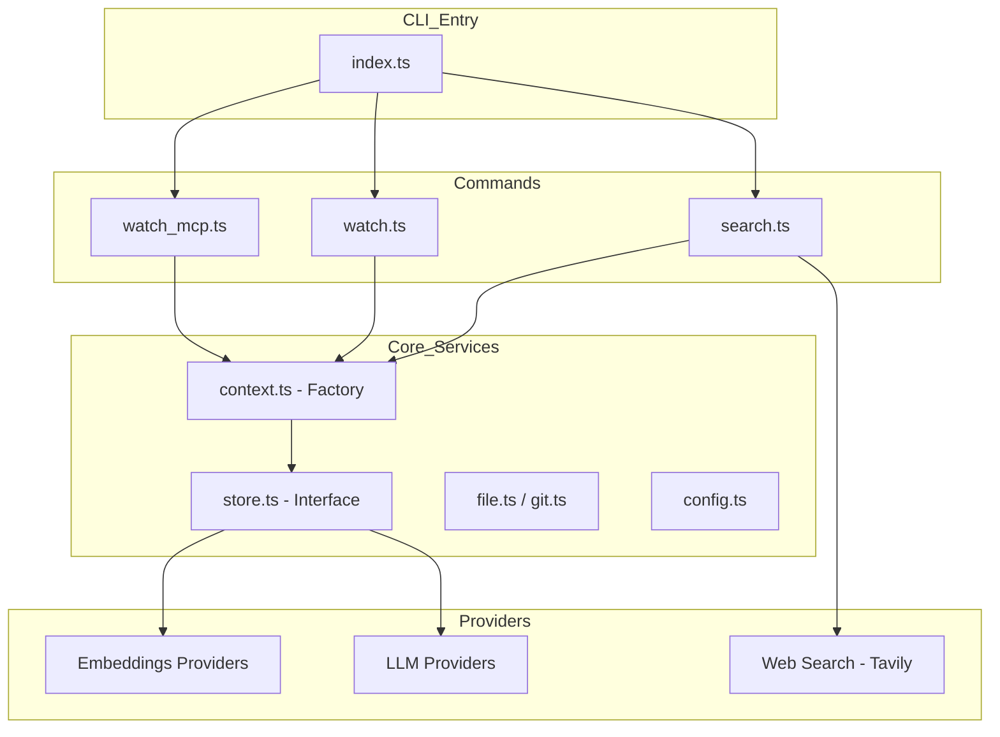
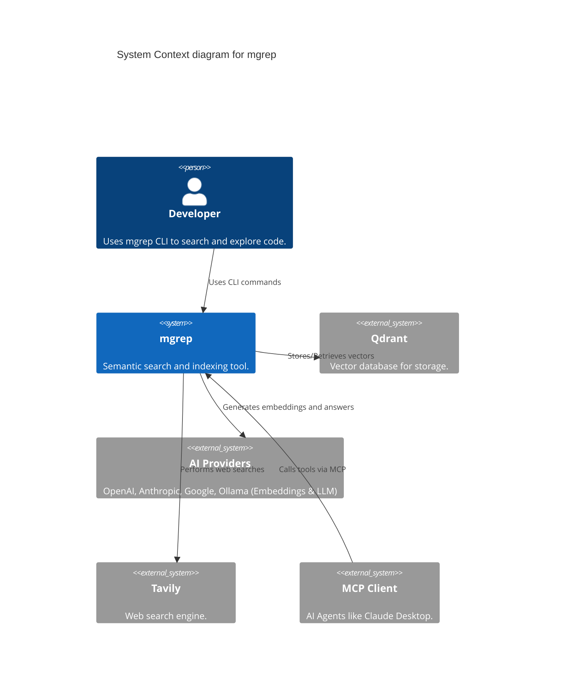
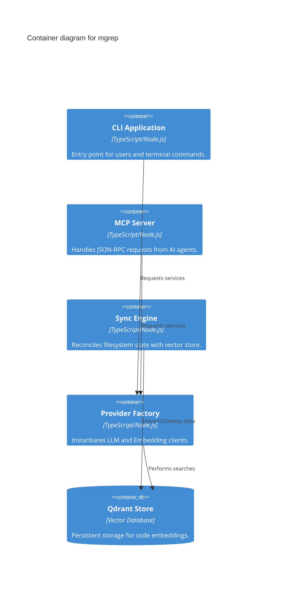

# mgrep

## Project Overview
**mgrep** is a high-performance CLI-based semantic search and file indexing tool designed to bridge the gap between local codebases and LLM-powered discovery. It synchronizes local files with a vector-based storage system, enabling developers and AI agents to perform natural language queries, ask complex questions about the code (RAG), and monitor file changes in real-time.

### Purpose and Main Functionality
The primary purpose of `mgrep` is to provide a "semantic grep" experience. Unlike traditional keyword-based search, `mgrep` understands the intent and context of code and documentation. It serves as a retrieval engine that can be used directly from the terminal or integrated into AI workflows via the Model Context Protocol (MCP).

### Key Features and Capabilities
- **Semantic Search**: Find code and documentation based on meaning rather than literal string matches.
- **RAG-Powered "Ask"**: Perform Retrieval-Augmented Generation to get AI-generated answers with direct citations from your codebase.
- **Multi-Provider Support**: Pluggable architecture supporting OpenAI, Anthropic, Google Gemini, and Ollama for both embeddings and LLM responses.
- **Real-time Synchronization**: A `watch` mode that monitors filesystem events and incrementally updates the vector store.
- **MCP Integration**: Built-in Model Context Protocol server that allows AI agents (like Claude Desktop) to use `mgrep` as a tool.
- **Web Search Integration**: Capability to augment local results with real-time web search via Tavily AI.
- **Git Awareness**: Automatically respects `.gitignore` and `.mgrepignore` rules for indexing.

### Likely Intended Use Cases
- **Code Discovery**: Quickly finding relevant modules or functions in large, unfamiliar codebases.
- **Developer Onboarding**: Asking high-level questions about architecture and implementation details.
- **AI Agent Tooling**: Providing a structured way for AI assistants to explore and understand a local project.
- **Documentation Search**: Searching through technical docs with natural language.

## Table of Contents
- [Project Overview](#project-overview)
- [Architecture](#architecture)
- [C4 Model Architecture](#c4-model-architecture)
- [Repository Structure](#repository-structure)
- [Dependencies and Integration](#dependencies-and-integration)
- [API Documentation](#api-documentation)
- [Development Notes](#development-notes)
- [Known Issues and Limitations](#known-issues-and-limitations)
- [Additional Documentation](#additional-documentation)

## Architecture
`mgrep` follows a **Provider-based Strategy** pattern, decoupling the core logic from specific AI vendors or storage implementations. The system is structured into three primary layers:

1.  **Command Layer**: Orchestrates high-level workflows (Search, Watch, MCP).
2.  **Service/Library Layer**: Core logic for filesystem traversal, Git integration, and text chunking.
3.  **Provider Layer**: Abstract interfaces for external AI services.

### Technology Stack
- **Runtime**: Node.js / TypeScript
- **CLI Framework**: Commander.js
- **Vector Database**: Qdrant (via `@qdrant/js-client-rest`)
- **AI Integration**: OpenAI SDK, Anthropic (REST), Google Gemini (REST), Ollama
- **Protocols**: Model Context Protocol (MCP)
- **Validation**: Zod
- **UI/UX**: @clack/prompts for interactive terminal components

### Component Relationships


### Key Design Patterns
- **Strategy Pattern**: Used for interchangeable AI providers and storage backends.
- **Command Pattern**: Isolated CLI modules for specific functionalities.
- **Adapter Pattern**: Wraps native Node.js and CLI tools (Git) into clean internal interfaces.
- **Observer Pattern**: Utilized in `watch` mode to react to filesystem changes.
- **Retrieval-Augmented Generation (RAG)**: The core mechanism for the `ask` command.

## C4 Model Architecture

<details>
<summary>View System Context Diagram</summary>


</details>

<details>
<summary>View Container Diagram</summary>


</details>

## Repository Structure
- `src/index.ts`: Main CLI entry point and command registration.
- `src/commands/`: Implementation of CLI commands (`search`, `watch`, `watch_mcp`).
- `src/lib/`:
    - `providers/`: AI service implementations (OpenAI, Anthropic, Google, etc.).
    - `config.ts`: Configuration loading and Zod schema validation.
    - `context.ts`: Dependency injection factory.
    - `qdrant-store.ts`: Main vector database implementation.
    - `file.ts` & `git.ts`: Filesystem and Git abstractions.
- `tavily-mcp/`: Specialized MCP server for standalone web search.

## Dependencies and Integration
`mgrep` integrates with the following services:
- **Vector Storage**: **Qdrant** is the primary store for indexed code data.
- **LLM Providers**: Supports **OpenAI**, **Anthropic (Claude)**, **Google (Gemini)**, and **Ollama**.
- **Embeddings**: Uses external providers to convert text chunks into vector representations.
- **Web Search**: **Tavily AI** for real-time web result retrieval.
- **MCP**: Integrates as a tool provider for any **Model Context Protocol** compatible client.

## API Documentation
`mgrep` exposes its functionality primarily through the **Model Context Protocol (MCP)**.

### MCP Tools (mgrep)
| Tool | Description | Key Parameters |
| :--- | :--- | :--- |
| `mgrep-search` | Semantic search over indexed files. | `query`, `path`, `max_results`, `rerank` |
| `mgrep-ask` | RAG-based question answering. | `question`, `path`, `max_results`, `rerank` |
| `mgrep-web-search`| Search the web using Tavily AI. | `query`, `max_results`, `include_content` |
| `mgrep-sync` | Force-sync local files with the store. | `dry_run` |
| `mgrep-get-file` | Retrieve file content with line range support. | `path`, `start_line`, `end_line` |
| `mgrep-list-files` | List indexed files with pagination. | `path_prefix`, `limit`, `offset`, `include_hash` |
| `mgrep-get-context` | Get expanded context around a line. | `path`, `line`, `context_lines` |
| `mgrep-stats` | Get store statistics. | (none) |

### External Service Requirements
- **API Keys**: Required for configured providers (e.g., `OPENAI_API_KEY`, `TAVILY_API_KEY`).
- **Qdrant**: Access to a Qdrant instance (local or cloud) via `MGREP_QDRANT_URL`.

## File Filtering

mgrep automatically ignores files that are not useful for semantic search.

### Default Categories

| Category | Examples | Configurable |
|----------|----------|--------------|
| `vendor` | `node_modules/`, `vendor/`, `Pods/` | Yes |
| `generated` | `dist/`, `*.min.js`, lock files | Yes |
| `binary` | `*.png`, `*.pdf`, `*.exe` | Yes |
| `config` | `.github/`, `Dockerfile` | Yes (off by default) |

### Custom Configuration

```yaml
# .mgreprc.yaml
ignore:
  categories:
    vendor: true
    generated: true
    config: true  # enable config indexing
  additional:
    - "internal/"
  exceptions:
    - "!vendor/important-lib/"  # keep this specific directory
```

### Precedence

1. `.gitignore` (in git repos)
2. `.mgrepignore`
3. Default patterns (configurable via `.mgreprc.yaml`)
4. CLI flags

### Inspection & Management Commands

- `mgrep config --show-ignore`: View active ignore patterns and categories.
- `mgrep check-ignore <path>`: Check if a specific file would be ignored.
- `mgrep sync`: Synchronize local files with the store.
- `mgrep sync --dry-run`: Preview changes without modifying the store.
- `mgrep sync --include-vendor`: Force indexing of vendor files.
- `mgrep sync --include-all`: Index everything (disable all ignore categories).

## Development Notes
- **Configuration**: Uses `.mgreprc.yaml` or global configuration files. Validated via Zod.
- **Sync Logic**: Uses SHA-256 hashing to determine file changes, ensuring efficient incremental updates.
- **Concurrency**: Bulk operations (like initial sync) are managed via configurable concurrency limits (default: 20).
- **Testing**:
    - **Vitest**: For unit and integration tests.
    - **BATS**: For end-to-end CLI behavior validation.
- **Performance**: Large files are chunked into overlapping windows (default 50 lines) to maintain context for embeddings.

## Known Issues and Limitations
- **File Size**: Files exceeding the configured `maxFileSize` (default 10MB) are skipped.
- **Binary Files**: Only text files are indexed; binary files are automatically detected and ignored.
- **Provider Stability**: Direct REST implementations for Anthropic and Google (instead of SDKs) require manual maintenance for API changes.
- **Store Support**: While the architecture is modular, `Qdrant` is currently the only non-test storage implementation.

## Additional Documentation
- [Architecture Analysis](.ai/docs/structure_analysis.md)
- [API Deep Dive](.ai/docs/api_analysis.md)
- [Data Flow Details](.ai/docs/data_flow_analysis.md)
- [Request Flow Mapping](.ai/docs/request_flow_analysis.md)
- [Claude Skill Integration](plugins/mgrep/skills/mgrep/SKILL.md)
