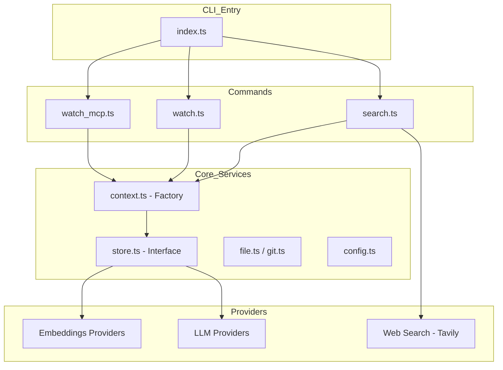
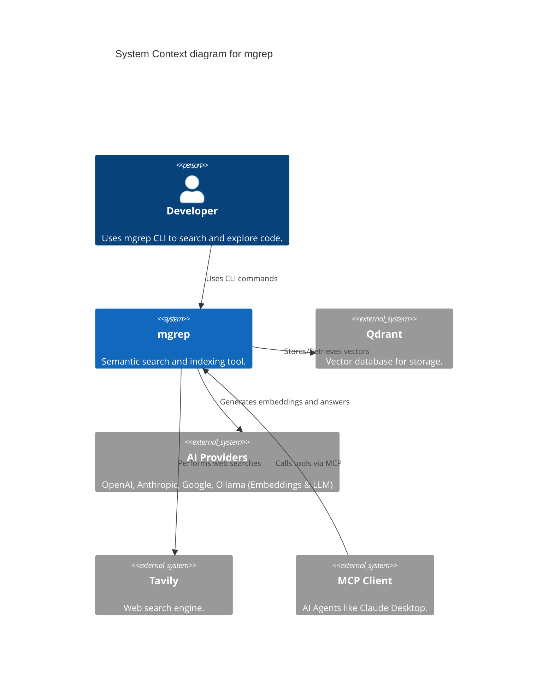
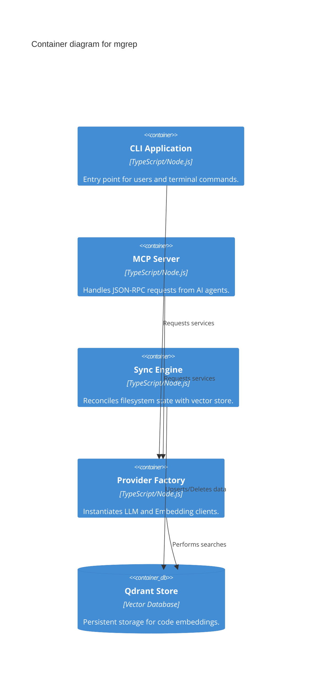

# mgrep

## Project Overview
**mgrep** is a high-performance CLI-based semantic search and file indexing tool designed to bridge the gap between local codebases and LLM-powered discovery. It synchronizes local files with a vector-based storage system, enabling developers and AI agents to perform natural language queries, ask complex questions about the code (RAG), and monitor file changes in real-time.

### Purpose and Main Functionality
The primary purpose of `mgrep` is to provide a "semantic grep" experience. Unlike traditional keyword-based search, `mgrep` understands the intent and context of code and documentation. It serves as a retrieval engine that can be used directly from the terminal or integrated into AI workflows via the Model Context Protocol (MCP).

### Key Features and Capabilities
- **Semantic Search**: Find code and documentation based on meaning rather than literal string matches.
- **RAG-Powered "Ask"**: Perform Retrieval-Augmented Generation to get AI-generated answers with direct citations from your codebase.
- **Multi-Provider Support**: Pluggable architecture supporting OpenAI, Anthropic, Google Gemini, and Ollama for both embeddings and LLM responses.
- **Real-time Synchronization**: A `watch` mode that monitors filesystem events and incrementally updates the vector store.
- **MCP Integration**: Built-in Model Context Protocol server that allows AI agents (like Claude Desktop) to use `mgrep` as a tool.
- **Web Search Integration**: Capability to augment local results with real-time web search via Tavily AI.
- **Git Awareness**: Automatically respects `.gitignore` and `.mgrepignore` rules for indexing.

### Likely Intended Use Cases
- **Code Discovery**: Quickly finding relevant modules or functions in large, unfamiliar codebases.
- **Developer Onboarding**: Asking high-level questions about architecture and implementation details.
- **AI Agent Tooling**: Providing a structured way for AI assistants to explore and understand a local project.
- **Documentation Search**: Searching through technical docs with natural language.

## Table of Contents
- [Project Overview](#project-overview)
- [Architecture](#architecture)
- [C4 Model Architecture](#c4-model-architecture)
- [Repository Structure](#repository-structure)
- [Dependencies and Integration](#dependencies-and-integration)
- [API Documentation](#api-documentation)
- [Development Notes](#development-notes)
- [Known Issues and Limitations](#known-issues-and-limitations)
- [Additional Documentation](#additional-documentation)

## Architecture
`mgrep` follows a **Provider-based Strategy** pattern, decoupling the core logic from specific AI vendors or storage implementations. The system is structured into three primary layers:

1.  **Command Layer**: Orchestrates high-level workflows (Search, Watch, MCP).
2.  **Service/Library Layer**: Core logic for filesystem traversal, Git integration, and text chunking.
3.  **Provider Layer**: Abstract interfaces for external AI services.

### Technology Stack
- **Runtime**: Node.js / TypeScript
- **CLI Framework**: Commander.js
- **Vector Database**: Qdrant (via `@qdrant/js-client-rest`)
- **AI Integration**: OpenAI SDK, Anthropic (REST), Google Gemini (REST), Ollama
- **Protocols**: Model Context Protocol (MCP)
- **Validation**: Zod
- **UI/UX**: @clack/prompts for interactive terminal components

### Component Relationships

```mermaid
graph TD
    subgraph CLI_Entry
        Index[index.ts]
    end

    subgraph Commands
        Search[search.ts]
        Watch[watch.ts]
        MCP_Cmd[watch_mcp.ts]
    end

    subgraph Core_Services
        Context[context.ts - Factory]
        Store[store.ts - Interface]
        FS[file.ts / git.ts]
        Config[config.ts]
    end

    subgraph Providers
        Embeddings[Embeddings Providers]
        LLM[LLM Providers]
        WebSearch[Web Search - Tavily]
    end

    Index --> Search
    Index --> Watch
    Index --> MCP_Cmd

    Search --> Context
    Watch --> Context
    MCP_Cmd --> Context

    Context --> Store
    Store --> Embeddings
    Store --> LLM
    Search --> WebSearch
```

### Key Design Patterns
- **Strategy Pattern**: Used for interchangeable AI providers and storage backends.
- **Command Pattern**: Isolated CLI modules for specific functionalities.
- **Adapter Pattern**: Wraps native Node.js and CLI tools (Git) into clean internal interfaces.
- **Observer Pattern**: Utilized in `watch` mode to react to filesystem changes.
- **Retrieval-Augmented Generation (RAG)**: The core mechanism for the `ask` command.

## C4 Model Architecture

<details>
<summary>View System Context Diagram</summary>


```mermaid
C4Context
    title System Context diagram for mgrep

    Person(developer, "Developer", "Uses mgrep CLI to search and explore code.")
    System(mgrep, "mgrep", "Semantic search and indexing tool.")
    System_Ext(qdrant, "Qdrant", "Vector database for storage.")
    System_Ext(ai_providers, "AI Providers", "OpenAI, Anthropic, Google, Ollama (Embeddings & LLM)")
    System_Ext(tavily, "Tavily", "Web search engine.")
    System_Ext(mcp_client, "MCP Client", "AI Agents like Claude Desktop.")

    Rel(developer, mgrep, "Uses CLI commands")
    Rel(mgrep, qdrant, "Stores/Retrieves vectors")
    Rel(mgrep, ai_providers, "Generates embeddings and answers")
    Rel(mgrep, tavily, "Performs web searches")
    Rel(mcp_client, mgrep, "Calls tools via MCP")
```
</details>

<details>
<summary>View Container Diagram</summary>


```mermaid
C4Container
    title Container diagram for mgrep

    Container(cli, "CLI Application", "TypeScript/Node.js", "Entry point for users and terminal commands.")
    Container(mcp_server, "MCP Server", "TypeScript/Node.js", "Handles JSON-RPC requests from AI agents.")
    Container(sync_engine, "Sync Engine", "TypeScript/Node.js", "Reconciles filesystem state with vector store.")
    Container(provider_factory, "Provider Factory", "TypeScript/Node.js", "Instantiates LLM and Embedding clients.")
    
    ContainerDb(qdrant_db, "Qdrant Store", "Vector Database", "Persistent storage for code embeddings.")

    Rel(cli, provider_factory, "Requests services")
    Rel(mcp_server, provider_factory, "Requests services")
    Rel(sync_engine, qdrant_db, "Upserts/Deletes data")
    Rel(provider_factory, qdrant_db, "Performs searches")
```
</details>

## Repository Structure
- `src/index.ts`: Main CLI entry point and command registration.
- `src/commands/`: Implementation of CLI commands (`search`, `watch`, `watch_mcp`).
- `src/lib/`:
    - `providers/`: AI service implementations (OpenAI, Anthropic, Google, etc.).
    - `config.ts`: Configuration loading and Zod schema validation.
    - `context.ts`: Dependency injection factory.
    - `qdrant-store.ts`: Main vector database implementation.
    - `file.ts` & `git.ts`: Filesystem and Git abstractions.
- `tavily-mcp/`: Specialized MCP server for standalone web search.

## Dependencies and Integration
`mgrep` integrates with the following services:
- **Vector Storage**: **Qdrant** is the primary store for indexed code data.
- **LLM Providers**: Supports **OpenAI**, **Anthropic (Claude)**, **Google (Gemini)**, and **Ollama**.
- **Embeddings**: Uses external providers to convert text chunks into vector representations.
- **Web Search**: **Tavily AI** for real-time web result retrieval.
- **MCP**: Integrates as a tool provider for any **Model Context Protocol** compatible client.

## API Documentation
`mgrep` exposes its functionality primarily through the **Model Context Protocol (MCP)**.

### MCP Tools (mgrep)
| Tool | Description | Key Parameters |
| :--- | :--- | :--- |
| `mgrep-search` | Semantic search over indexed files. | `query`, `path`, `max_results`, `rerank` |
| `mgrep-ask` | RAG-based question answering. | `question`, `path`, `max_results`, `rerank` |
| `mgrep-web-search`| Search the web using Tavily AI. | `query`, `max_results`, `include_content` |
| `mgrep-sync` | Force-sync local files with the store. | `dry_run` |
| `mgrep-get-file` | Retrieve file content with line range support. | `path`, `start_line`, `end_line` |
| `mgrep-list-files` | List indexed files with pagination. | `path_prefix`, `limit`, `offset`, `include_hash` |
| `mgrep-get-context` | Get expanded context around a line. | `path`, `line`, `context_lines` |
| `mgrep-stats` | Get store statistics. | (none) |
| `mgrep-find-symbol` | Find symbol definitions (functions, classes, interfaces, types). | `name`, `type`, `path`, `exact`, `max_results` |
| `mgrep-find-references` | Find all usages/references of a symbol. | `symbol`, `path`, `include_definition`, `max_results` |

### MCP Resources

mgrep implements MCP Resources to allow agents to browse indexed files directly without calling tools.

#### Resource Format

Resources are exposed as files with URI format: `mgrep://file/{path}`

| Property | Description |
|----------|-------------|
| URI | Unique identifier for resource (e.g., `mgrep://file/src/lib/file.ts`) |
| name | File name or description |
| mimeType | Content type (always `text/plain` for text files) |

#### Benefits

- **Direct File Access**: Agents can read files without tool call overhead
- **Better UX**: File browsers in agent UI show project structure clearly
- **Reduced Tool Calls**: Agents can scan codebase using Resources instead of repeated mgrep-get-file calls
- **Standard Protocol**: Uses Model Context Protocol Resources specification

#### Usage Example

```bash
# Agent can access files directly by reading resources
# No need to call mgrep-get-file for each file
```

### External Service Requirements
- **API Keys**: Required for configured providers (e.g., `OPENAI_API_KEY`, `TAVILY_API_KEY`).
- **Qdrant**: Access to a Qdrant instance (local or cloud) via `MGREP_QDRANT_URL`.

### Symbol Search

mgrep provides symbol search capabilities to locate function/class definitions and find all usages across the codebase. This is essential for refactoring, impact analysis, and code navigation workflows.

#### Supported Symbol Types

| Type | Description | Examples |
|-------|-------------|----------|
| `function` | Function declarations and methods | `function main()`, `async function fetch()` |
| `class` | Class definitions | `class Database`, `export class Store` |
| `interface` | Interface definitions | `interface Store`, `type Config` |
| `type` | Type aliases | `type Result`, `interface Filter` |
| `variable` | Variable and constant declarations | `const MAX_SIZE`, `let count` |
| `method` | Class methods | `save()`, `load()`, `find()` |

#### Usage Examples

**Finding a function definition:**
```bash
mgrep find-symbol --name "createStore" --type function
```

**Finding all usages of a function:**
```bash
mgrep find-references --symbol "initialSync" --include-definition
```

**Finding classes in a specific directory:**
```bash
mgrep find-symbol --name "Store" --type class --path src/lib
```

**Partial vs exact matching:**
```bash
# Partial match (default) - finds createStore, createTestStore, etc.
mgrep find-symbol --name "Store" --type function

# Exact match - only finds symbols named "Store"
mgrep find-symbol --name "Store" --type function --exact
```

#### Use Cases

- **Refactoring**: Find all usages of a function before renaming or modifying it
- **Impact Analysis**: Understand which files will be affected by changing a class or interface
- **Code Navigation**: Quickly jump to where a symbol is defined
- **Understanding Dependencies**: Trace how symbols are used throughout the codebase
- **API Exploration**: Discover available functions, classes, and interfaces in a module

#### Language Support

Currently supported languages:
- **TypeScript** - Full support for all symbol types
- **JavaScript** - Function, class, and variable detection
- **Python** - Function, class, and variable detection

More languages will be added in future versions.

#### Example Agent Workflow for Refactoring

```
# Step1: Find function definition
mgrep-find-symbol(name="processData", type="function")

# Step 2: Find all usages
mgrep-find-references(symbol="processData", include_definition=true)

# Step 3: Review usages to understand impact
mgrep-get-context(path="src/lib/processor.ts", line=45, context_lines=10)
```

### MCP Prompts

mgrep provides workflow templates (prompts) that guide agents through common development tasks using multi-step tool calls.

#### Available Prompts

| Prompt | Description | Arguments |
|--------|-------------|------------|
| codebase-overview | Get comprehensive overview of codebase structure and architecture | (none) |
| find-implementation | Find how a specific feature is implemented | `feature` (required) |
| debug-flow | Trace execution flow for debugging functionality | `entrypoint` (required) |
| find-similar-code | Find code similar to a given snippet | `code` (required) |

#### Usage Examples

**Codebase Overview** (for new projects):
```bash
mgrep prompt codebase-overview
```

**Find Implementation**:
```bash
mgrep prompt find-implementation --feature authentication
```

**Debug Flow**:
```bash
mgrep prompt debug-flow --entrypoint processRequest
```

**Find Similar Code**:
```bash
mgrep prompt find-similar-code --code "function processRequest(req) { return res; }"
```

#### Benefits

- **Guided Workflows**: Agents get step-by-step instructions instead of guessing which tools to call
- **Better Context**: Multi-step searches build richer context for complex tasks
- **Faster Onboarding**: New developers can quickly understand codebase structure
- **Consistency**: Standardized patterns for common development tasks
- **Reduced Tool Calls**: Agents make fewer redundant calls when using workflows

### Tool Safety (Annotations)

mgrep uses MCP tool annotations to improve agent safety and enable auto-approval for safe operations.

#### Annotation Types

| Annotation | Description | Example |
|-----------|-------------|---------|
| `readOnlyHint` | Tool only reads data, no side effects | `mgrep-search`, `mgrep-ask`, `mgrep-stats` |
| `idempotentHint` | Tool can be called multiple times safely | `mgrep-sync` |
| `destructiveHint` | Tool modifies or deletes data | (none currently) |

#### Tool Annotations Table

| Tool | readOnly | idempotent | destructive | Notes |
|------|----------|-------------|-------------|
| mgrep-search | ✓ | - | - | Read-only semantic search |
| mgrep-ask | ✓ | - | - | Read-only RAG问答 |
| mgrep-web-search | ✓ | - | - | Read-only web search |
| mgrep-sync | - | ✓ | - | Safe to call multiple times |
| mgrep-get-file | ✓ | - | - | Read-only file retrieval |
| mgrep-list-files | ✓ | - | - | Read-only file listing |
| mgrep-get-context | ✓ | - | - | Read-only context retrieval |
| mgrep-stats | ✓ | - | - | Read-only statistics |
| mgrep-find-symbol | ✓ | - | - | Read-only symbol search |
| mgrep-find-references | ✓ | - | - | Read-only reference finding |

#### Agent Benefits

- **Auto-Approval**: Agents like Claude Desktop can auto-approve read-only tools without user confirmation
- **Safety**: Destructive tools (if any) require explicit user approval
- **Efficiency**: Safe operations don't need confirmation prompts, speeding up agent workflows
- **Transparency**: Annotations clearly communicate tool behavior to users and agents
# Step 1: Find the function definition
mgrep-find-symbol(name="processData", type="function")

# Step 2: Find all references
mgrep-find-references(symbol="processData", include_definition=true)

# Step 3: Review usages to understand impact
mgrep-get-context(path="src/lib/processor.ts", line=45, context_lines=10)
```

## File Filtering

mgrep automatically ignores files that are not useful for semantic search.

### Default Categories

| Category | Examples | Configurable |
|----------|----------|--------------|
| `vendor` | `node_modules/`, `vendor/`, `Pods/` | Yes |
| `generated` | `dist/`, `*.min.js`, lock files | Yes |
| `binary` | `*.png`, `*.pdf`, `*.exe` | Yes |
| `config` | `.github/`, `Dockerfile` | Yes (off by default) |

### Custom Configuration

```yaml
# .mgreprc.yaml
ignore:
  categories:
    vendor: true
    generated: true
    config: true  # enable config indexing
  additional:
    - "internal/"
  exceptions:
    - "!vendor/important-lib/"  # keep this specific directory
```

### Precedence

1. `.gitignore` (in git repos)
2. `.mgrepignore`
3. Default patterns (configurable via `.mgreprc.yaml`)
4. CLI flags

### Inspection & Management Commands

- `mgrep config --show-ignore`: View active ignore patterns and categories.
- `mgrep check-ignore <path>`: Check if a specific file would be ignored.
- `mgrep sync`: Synchronize local files with the store.
- `mgrep sync --dry-run`: Preview changes without modifying the store.
- `mgrep sync --include-vendor`: Force indexing of vendor files.
- `mgrep sync --include-all`: Index everything (disable all ignore categories).

### Intelligent Detection

mgrep includes intelligent detection for certain file patterns:

- **Minified Files**: Detects minified JavaScript/CSS by average line length (>500) or small file size (<10 lines, >10KB).
- **Generated Markers**: Detects "Code generated", "DO NOT EDIT" in file headers (first 10 lines).
- **Source Maps**: Detects `sourceMappingURL` or `sourceURL` in last 3 lines of files.

These detections are automatically applied during sync and files are excluded from indexing.

## Development Notes
- **Configuration**: Uses `.mgreprc.yaml` or global configuration files. Validated via Zod.
- **Sync Logic**: Uses SHA-256 hashing to determine file changes, ensuring efficient incremental updates.
- **Concurrency**: Bulk operations (like initial sync) are managed via configurable concurrency limits (default: 20).
- **Testing**:
    - **Vitest**: For unit and integration tests.
    - **BATS**: For end-to-end CLI behavior validation.
- **MCP Test Coverage**: Target is 80%+ for `src/commands/watch_mcp.ts`. Run `npm run test:unit -- watch_mcp` to execute tests. See [MCP Testing Guide](docs/MCP_TESTING.md) for manual E2E testing procedures.
- **Performance**: Large files are chunked into overlapping windows (default 50 lines) to maintain context for embeddings.

## Known Issues and Limitations
- **File Size**: Files exceeding the configured `maxFileSize` (default 10MB) are skipped.
- **Binary Files**: Only text files are indexed; binary files are automatically detected and ignored.
- **Provider Stability**: Direct REST implementations for Anthropic and Google (instead of SDKs) require manual maintenance for API changes.
- **Store Support**: While the architecture is modular, `Qdrant` is currently the only non-test storage implementation.

## Additional Documentation
- [Architecture Analysis](.ai/docs/structure_analysis.md)
- [API Deep Dive](.ai/docs/api_analysis.md)
- [Data Flow Details](.ai/docs/data_flow_analysis.md)
- [Request Flow Mapping](.ai/docs/request_flow_analysis.md)
- [Claude Skill Integration](plugins/mgrep/skills/mgrep/SKILL.md)
