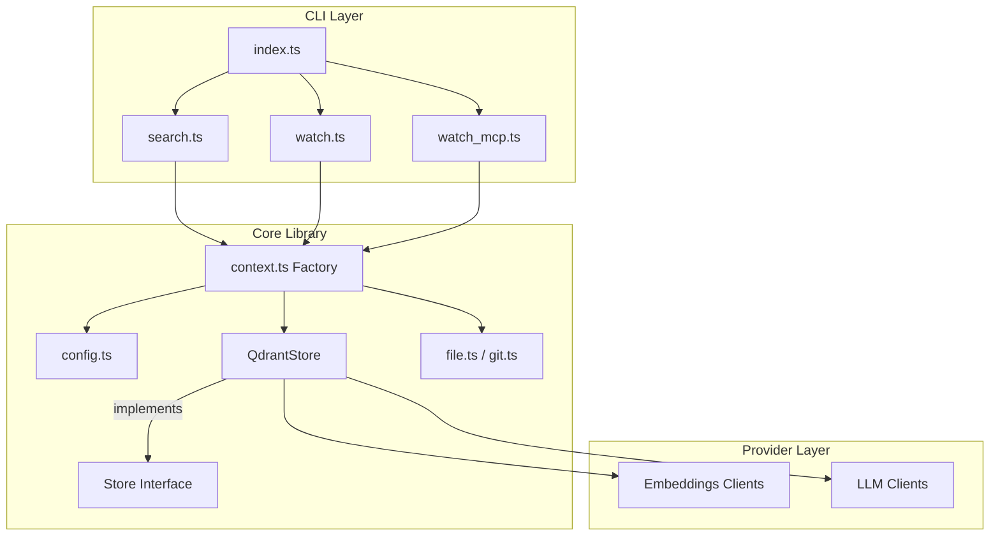
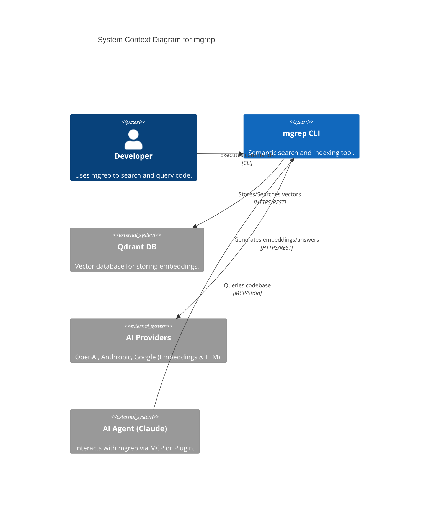
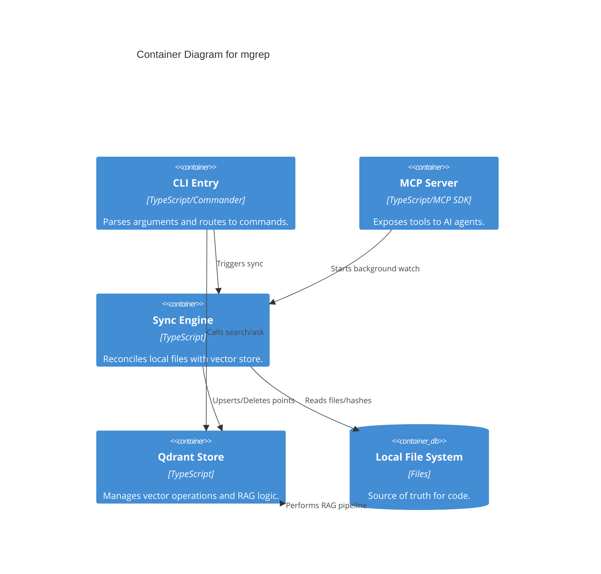

## Context

You are an AI assistant helping with software development tasks.

**Current Date:** 2025-12-21 14:25:37

---

## Task Description

Revise PLAN.md e sugira melhorias ou correções, se necessário.

---

## Project Constraints & Rules


---

## Project Structure

└── mgrep/
    ├── dist/
    ├── node_modules/
    ├── AGENTS.md [2.4KB]
    ├── CLAUDE.md [3.9KB]
    ├── LICENSE [11.1KB]
    ├── Makefile [3.4KB]
    ├── PLAN.md [19.8KB]
    ├── README.md [9.2KB]
    └── biome.json [682B]

<file path="AGENTS.md">
# AGENTS.md - Universal AI Agent Configuration

## Project Overview
`mgrep` is a TypeScript-based CLI tool for semantic code search, web search, and RAG-based question answering. It synchronizes local file systems with a Qdrant vector database and supports multiple AI providers (OpenAI, Google, Anthropic, Ollama) for embeddings and LLMs. Web search is powered by Tavily.

## Build & Test Commands
- **Install**: `npm install`
- **Build**: `npm run build`
- **Lint/Format**: `npm run lint` (check) or `npm run lint:write` (fix via Biome)
- **Test**: `npm run test` (Runs Bats tests; sets `MGREP_IS_TEST=1` for in-memory `TestStore`)
- **Run CLI**: `npm run start -- <command>` (via ts-node) or `./bin/run <command>` (built)

## Architecture Overview
- **Pattern**: Sync-on-Demand. Local files are reconciled with the vector store before search/query.
- **Layers**: CLI (`src/index.ts`) -> Commands (`src/commands/`) -> Service/Library (`src/lib/`) -> Providers.
- **Core Abstractions**: `Store` interface (`src/lib/store.ts`) implemented by `QdrantStore`.
- **Provider System**: Strategy pattern for `EmbeddingsClient`, `LLMClient` (OpenAI, Google, Anthropic), and `WebSearchClient` (Tavily).
- **Composition Root**: `src/lib/context.ts` uses Factory pattern to instantiate all services.

## Code Style Conventions
- **Language**: TypeScript (Strict typing preferred).
- **Tooling**: Biome for linting and formatting.
- **Patterns**: Strategy pattern for providers, Factory pattern for service creation, Adapter pattern for FS/Git.

## Key Conventions
- **Service Creation**: Always use `createStore()`, `createGit()`, `createFileSystem()`, or `createWebSearchClientFromConfig()` from `src/lib/context.ts`.
- **Configuration**: Hierarchical: CLI Flags > Env Vars (`MGREP_*`) > `.mgreprc.yaml` > `~/.config/mgrep/config.yaml`.
- **Web Search**: Use `--web` flag with `MGREP_TAVILY_API_KEY` or `tavily.apiKey` in config.
- **Indexing**: Files are chunked (50 lines, 10 overlap) in `QdrantStore.chunkText`.
- **Deterministic IDs**: Qdrant point IDs are SHA256 hashes of `externalId` + `chunkIndex` for idempotency.
- **Filtering**: Uses `path_scopes` (e.g., `["/src", "/src/lib"]`) for efficient directory filtering in Qdrant.
- **Ignore Rules**: Respects `.gitignore` and `.mgrepignore` via `src/lib/file.ts`.

## Git Workflows
- **Branching**: `feat/`, `fix/`, `docs/`, `chore/`.
- **Commits**: Conventional Commits (e.g., `feat(provider): add deepseek support`).
</file>
<file path="biome.json">
{
  "$schema": "https://biomejs.dev/schemas/2.3.4/schema.json",
  "vcs": {
    "enabled": true,
    "clientKind": "git",
    "useIgnoreFile": true
  },
  "files": {
    "includes": [
      "**",
      "!!**/dist",
      "!node_modules",
      "!tavily-mcp",
      "!.letta",
      "!coverage"
    ]
  },
  "formatter": {
    "enabled": true,
    "indentStyle": "space",
    "indentWidth": 2
  },
  "linter": {
    "enabled": true,
    "rules": {
      "recommended": true
    }
  },
  "javascript": {
    "formatter": {
      "quoteStyle": "double"
    }
  },
  "assist": {
    "enabled": true,
    "actions": {
      "source": {
        "organizeImports": "on"
      }
    }
  }
}
</file>
<file path="CLAUDE.md">
# CLAUDE.md - Guide for mgrep Development

Hello! I'm the developer of `mgrep`. This guide provides the context you need to effectively work on this semantic search CLI tool.

## Project Overview
`mgrep` is a modern, AI-powered replacement for `grep`. It indexes codebases into a Qdrant vector database and allows for semantic searching and RAG (Retrieval-Augmented Generation) question answering. It bridges local file systems with vector-based retrieval, supporting OpenAI, Anthropic, Google Gemini, and local Ollama instances.

## Common Commands
- **Install dependencies**: `npm install`
- **Build project**: `npm run build`
- **Lint & Format**: `npm run lint` (check) or `npm run lint:write` (fix via Biome)
- **Run tests**: `npm run test` (Runs Bats tests with `MGREP_IS_TEST=1`)
- **Run CLI locally**:
  - `npm run start -- search "query"` (Direct via ts-node)
  - `./bin/run search "query"` (After build)
- **Start MCP Server**: `npm run start -- mcp`

## Prerequisites for Development
1. **Qdrant**: Must be running for indexing/search.
   ```bash
   docker run -p 6333:6333 qdrant/qdrant
   ```
2. **API Keys**: Set at least one of `OPENAI_API_KEY`, `GOOGLE_API_KEY`, or `ANTHROPIC_API_KEY`.
3. **Web Search (optional)**: Set `MGREP_TAVILY_API_KEY` for web search functionality (`--web` flag).
4. **Test Mode**: Set `MGREP_IS_TEST=1` to bypass Qdrant and use the in-memory `TestStore`.

## Architecture & Key Components
The project follows a modular, provider-based architecture with a **Sync-on-Demand** pattern:

- **CLI Layer (`src/index.ts`, `src/commands/`)**: Uses `commander` to route commands.
  - `search.ts`: Primary interface for semantic search and RAG.
  - `watch.ts`: Monitors file system for incremental updates.
  - `watch_mcp.ts`: Implements Model Context Protocol for AI agent integration.
- **Service Abstraction (`src/lib/store.ts`)**: Defines the `Store` interface for all vector operations.
- **Qdrant Implementation (`src/lib/qdrant-store.ts`)**: Handles text chunking (50 lines/10 overlap), deterministic UUID generation for points, and path-scope metadata for filtering.
- **Provider Layer (`src/lib/providers/`)**:
  - `embeddings/`: OpenAI and Google implementations.
  - `llm/`: OpenAI, Google, and Anthropic implementations.
  - `web/`: Tavily implementation for web search.
- **Context Factory (`src/lib/context.ts`)**: The "Composition Root" where services are instantiated based on configuration.
- **Configuration (`src/lib/config.ts`)**: Hierarchical loading (CLI > Env > Local YAML > Global YAML) validated with Zod.
- **Sync Service (`src/lib/utils.ts`)**: `initialSync` reconciles local file system state with the vector store using SHA256 hashes.

## Code Style & Conventions
- **TypeScript**: Strict typing is preferred.
- **Formatting**: Handled by Biome. Run `npm run lint:write` before committing.
- **Commits**: Follow [Conventional Commits](https://www.conventionalcommits.org/) (e.g., `feat(provider): add support for deepseek`).
- **Branching**: Use prefixes like `feat/`, `fix/`, or `docs/`.

## Development Gotchas
- **Deterministic IDs**: We use SHA256 hashes of file paths and chunk indices to generate Qdrant point IDs. This ensures idempotency during sync.
- **Path Scoping**: We store paths as arrays (e.g., `/a/b/c` -> `["/", "/a", "/a/b", "/a/b/c"]`) to allow Qdrant to filter by directory prefix efficiently.
- **File Filtering**: `NodeFileSystem` (in `src/lib/file.ts`) integrates with `ignore` to respect `.gitignore` and `.mgrepignore`.
- **Logging**: We use `winston` with daily rotation. Logs are stored in `~/.local/state/mgrep/logs`.
- **MCP Integration**: `watch_mcp.ts` provides a Model Context Protocol server. It redirects `stdout` to `stderr` to keep the communication channel clean.

## Testing
Tests use the **Bats** framework. When running `npm run test`, the environment variable `MGREP_IS_TEST=1` is set, which forces `createStore()` to return a `TestStore` (in-memory) instead of connecting to Qdrant.
</file>
<file path="LICENSE">
                                 Apache License
                           Version 2.0, January 2004
                        http://www.apache.org/licenses/

   TERMS AND CONDITIONS FOR USE, REPRODUCTION, AND DISTRIBUTION

   1. Definitions.

      "License" shall mean the terms and conditions for use, reproduction,
      and distribution as defined by Sections 1 through 9 of this document.

      "Licensor" shall mean the copyright owner or entity authorized by
      the copyright owner that is granting the License.

      "Legal Entity" shall mean the union of the acting entity and all
      other entities that control, are controlled by, or are under common
      control with that entity. For the purposes of this definition,
      "control" means (i) the power, direct or indirect, to cause the
      direction or management of such entity, whether by contract or
      otherwise, or (ii) ownership of fifty percent (50%) or more of the
      outstanding shares, or (iii) beneficial ownership of such entity.

      "You" (or "Your") shall mean an individual or Legal Entity
      exercising permissions granted by this License.

      "Source" form shall mean the preferred form for making modifications,
      including but not limited to software source code, documentation
      source, and configuration files.

      "Object" form shall mean any form resulting from mechanical
      transformation or translation of a Source form, including but
      not limited to compiled object code, generated documentation,
      and conversions to other media types.

      "Work" shall mean the work of authorship, whether in Source or
      Object form, made available under the License, as indicated by a
      copyright notice that is included in or attached to the work
      (an example is provided in the Appendix below).

      "Derivative Works" shall mean any work, whether in Source or Object
      form, that is based on (or derived from) the Work and for which the
      editorial revisions, annotations, elaborations, or other modifications
      represent, as a whole, an original work of authorship. For the purposes
      of this License, Derivative Works shall not include works that remain
      separable from, or merely link (or bind by name) to the interfaces of,
      the Work and Derivative Works thereof.

      "Contribution" shall mean any work of authorship, including
      the original version of the Work and any modifications or additions
      to that Work or Derivative Works thereof, that is intentionally
      submitted to Licensor for inclusion in the Work by the copyright owner
      or by an individual or Legal Entity authorized to submit on behalf of
      the copyright owner. For the purposes of this definition, "submitted"
      means any form of electronic, verbal, or written communication sent
      to the Licensor or its representatives, including but not limited to
      communication on electronic mailing lists, source code control systems,
      and issue tracking systems that are managed by, or on behalf of, the
      Licensor for the purpose of discussing and improving the Work, but
      excluding communication that is conspicuously marked or otherwise
      designated in writing by the copyright owner as "Not a Contribution."

      "Contributor" shall mean Licensor and any individual or Legal Entity
      on behalf of whom a Contribution has been received by Licensor and
      subsequently incorporated within the Work.

   2. Grant of Copyright License. Subject to the terms and conditions of
      this License, each Contributor hereby grants to You a perpetual,
      worldwide, non-exclusive, no-charge, royalty-free, irrevocable
      copyright license to reproduce, prepare Derivative Works of,
      publicly display, publicly perform, sublicense, and distribute the
      Work and such Derivative Works in Source or Object form.

   3. Grant of Patent License. Subject to the terms and conditions of
      this License, each Contributor hereby grants to You a perpetual,
      worldwide, non-exclusive, no-charge, royalty-free, irrevocable
      (except as stated in this section) patent license to make, have made,
      use, offer to sell, sell, import, and otherwise transfer the Work,
      where such license applies only to those patent claims licensable
      by such Contributor that are necessarily infringed by their
      Contribution(s) alone or by combination of their Contribution(s)
      with the Work to which such Contribution(s) was submitted. If You
      institute patent litigation against any entity (including a
      cross-claim or counterclaim in a lawsuit) alleging that the Work
      or a Contribution incorporated within the Work constitutes direct
      or contributory patent infringement, then any patent licenses
      granted to You under this License for that Work shall terminate
      as of the date such litigation is filed.

   4. Redistribution. You may reproduce and distribute copies of the
      Work or Derivative Works thereof in any medium, with or without
      modifications, and in Source or Object form, provided that You
      meet the following conditions:

      (a) You must give any other recipients of the Work or
          Derivative Works a copy of this License; and

      (b) You must cause any modified files to carry prominent notices
          stating that You changed the files; and

      (c) You must retain, in the Source form of any Derivative Works
          that You distribute, all copyright, patent, trademark, and
          attribution notices from the Source form of the Work,
          excluding those notices that do not pertain to any part of
          the Derivative Works; and

      (d) If the Work includes a "NOTICE" text file as part of its
          distribution, then any Derivative Works that You distribute must
          include a readable copy of the attribution notices contained
          within such NOTICE file, excluding those notices that do not
          pertain to any part of the Derivative Works, in at least one
          of the following places: within a NOTICE text file distributed
          as part of the Derivative Works; within the Source form or
          documentation, if provided along with the Derivative Works; or,
          within a display generated by the Derivative Works, if and
          wherever such third-party notices normally appear. The contents
          of the NOTICE file are for informational purposes only and
          do not modify the License. You may add Your own attribution
          notices within Derivative Works that You distribute, alongside
          or as an addendum to the NOTICE text from the Work, provided
          that such additional attribution notices cannot be construed
          as modifying the License.

      You may add Your own copyright statement to Your modifications and
      may provide additional or different license terms and conditions
      for use, reproduction, or distribution of Your modifications, or
      for any such Derivative Works as a whole, provided Your use,
      reproduction, and distribution of the Work otherwise complies with
      the conditions stated in this License.

   5. Submission of Contributions. Unless You explicitly state otherwise,
      any Contribution intentionally submitted for inclusion in the Work
      by You to the Licensor shall be under the terms and conditions of
      this License, without any additional terms or conditions.
      Notwithstanding the above, nothing herein shall supersede or modify
      the terms of any separate license agreement you may have executed
      with Licensor regarding such Contributions.

   6. Trademarks. This License does not grant permission to use the trade
      names, trademarks, service marks, or product names of the Licensor,
      except as required for reasonable and customary use in describing the
      origin of the Work and reproducing the content of the NOTICE file.

   7. Disclaimer of Warranty. Unless required by applicable law or
      agreed to in writing, Licensor provides the Work (and each
      Contributor provides its Contributions) on an "AS IS" BASIS,
      WITHOUT WARRANTIES OR CONDITIONS OF ANY KIND, either express or
      implied, including, without limitation, any warranties or conditions
      of TITLE, NON-INFRINGEMENT, MERCHANTABILITY, or FITNESS FOR A
      PARTICULAR PURPOSE. You are solely responsible for determining the
      appropriateness of using or redistributing the Work and assume any
      risks associated with Your exercise of permissions under this License.

   8. Limitation of Liability. In no event and under no legal theory,
      whether in tort (including negligence), contract, or otherwise,
      unless required by applicable law (such as deliberate and grossly
      negligent acts) or agreed to in writing, shall any Contributor be
      liable to You for damages, including any direct, indirect, special,
      incidental, or consequential damages of any character arising as a
      result of this License or out of the use or inability to use the
      Work (including but not limited to damages for loss of goodwill,
      work stoppage, computer failure or malfunction, or any and all
      other commercial damages or losses), even if such Contributor
      has been advised of the possibility of such damages.

   9. Accepting Warranty or Additional Liability. While redistributing
      the Work or Derivative Works thereof, You may choose to offer,
      and charge a fee for, acceptance of support, warranty, indemnity,
      or other liability obligations and/or rights consistent with this
      License. However, in accepting such obligations, You may act only
      on Your own behalf and on Your sole responsibility, not on behalf
      of any other Contributor, and only if You agree to indemnify,
      defend, and hold each Contributor harmless for any liability
      incurred by, or claims asserted against, such Contributor by reason
      of your accepting any such warranty or additional liability.

   END OF TERMS AND CONDITIONS

   APPENDIX: How to apply the Apache License to your work.

      To apply the Apache License to your work, attach the following
      boilerplate notice, with the fields enclosed by brackets "[]"
      replaced with your own identifying information. (Don't include
      the brackets!)  The text should be enclosed in the appropriate
      comment syntax for the file format. We also recommend that a
      file or class name and description of purpose be included on the
      same "printed page" as the copyright notice for easier
      identification within third-party archives.

   Copyright [2025] [Mixedbread AI]

   Licensed under the Apache License, Version 2.0 (the "License");
   you may not use this file except in compliance with the License.
   You may obtain a copy of the License at

       http://www.apache.org/licenses/LICENSE-2.0

   Unless required by applicable law or agreed to in writing, software
   distributed under the License is distributed on an "AS IS" BASIS,
   WITHOUT WARRANTIES OR CONDITIONS OF ANY KIND, either express or implied.
   See the License for the specific language governing permissions and
   limitations under the License.
</file>
<file path="Makefile">
.PHONY: help build install uninstall dev test lint format clean qdrant-start qdrant-stop deps typecheck

# Default target
.DEFAULT_GOAL := help

# Colors for pretty output
BLUE := \033[0;34m
GREEN := \033[0;32m
YELLOW := \033[0;33m
RED := \033[0;31m
NC := \033[0m

help: ## Show this help message
	@printf "$(BLUE)mgrep$(NC) - Semantic grep-like search tool\n"
	@printf "\n"
	@printf "$(YELLOW)Usage:$(NC)\n"
	@printf "  make $(GREEN)<target>$(NC)\n"
	@printf "\n"
	@printf "$(YELLOW)Targets:$(NC)\n"
	@grep -E '^[a-zA-Z_-]+:.*?## .*$$' $(MAKEFILE_LIST) | sort | awk 'BEGIN {FS = ":.*?## "}; {printf "  $(GREEN)%-15s$(NC) %s\n", $$1, $$2}'

deps: ## Install dependencies
	@printf "$(BLUE)Installing dependencies...$(NC)\n"
	@npm install

build: ## Build the project
	@printf "$(BLUE)Building mgrep...$(NC)\n"
	@npm run build
	@printf "$(GREEN)Build complete!$(NC)\n"

install: build ## Install mgrep globally
	@printf "$(BLUE)Installing mgrep globally...$(NC)\n"
	@npm link
	@printf "$(GREEN)mgrep installed! Run 'mgrep --help' to get started.$(NC)\n"

uninstall: ## Uninstall mgrep globally
	@printf "$(YELLOW)Uninstalling mgrep...$(NC)\n"
	@npm unlink -g mgrep 2>/dev/null || npm rm -g mgrep 2>/dev/null || true
	@printf "$(GREEN)mgrep uninstalled.$(NC)\n"

reinstall: uninstall install ## Reinstall mgrep globally

dev: ## Run in development mode (build + run)
	@npm run dev

test: ## Run tests
	@printf "$(BLUE)Running tests...$(NC)\n"
	@npm run test

lint: ## Check code with linter
	@printf "$(BLUE)Linting code...$(NC)\n"
	@npm run lint

format: ## Format code
	@printf "$(BLUE)Formatting code...$(NC)\n"
	@npm run format

typecheck: ## Run TypeScript type checking
	@printf "$(BLUE)Type checking...$(NC)\n"
	@npm run typecheck

clean: ## Clean build artifacts
	@printf "$(YELLOW)Cleaning build artifacts...$(NC)\n"
	@rm -rf dist
	@rm -f tsconfig.tsbuildinfo
	@printf "$(GREEN)Clean complete!$(NC)\n"

clean-all: clean ## Clean everything including node_modules
	@printf "$(YELLOW)Removing node_modules...$(NC)\n"
	@rm -rf node_modules
	@printf "$(GREEN)Full clean complete!$(NC)\n"

qdrant-start: ## Start Qdrant in Docker
	@printf "$(BLUE)Starting Qdrant...$(NC)\n"
	@if docker ps -q -f name=qdrant | grep -q .; then \
		printf "$(YELLOW)Qdrant is already running.$(NC)\n"; \
	else \
		docker run -d --name qdrant -p 6333:6333 -p 6334:6334 \
			-v qdrant_storage:/qdrant/storage:z \
			qdrant/qdrant; \
		printf "$(GREEN)Qdrant started on http://localhost:6333$(NC)\n"; \
	fi

qdrant-stop: ## Stop Qdrant Docker container
	@printf "$(YELLOW)Stopping Qdrant...$(NC)\n"
	@docker stop qdrant 2>/dev/null || true
	@docker rm qdrant 2>/dev/null || true
	@printf "$(GREEN)Qdrant stopped.$(NC)\n"

qdrant-restart: qdrant-stop qdrant-start ## Restart Qdrant

qdrant-logs: ## Show Qdrant logs
	@docker logs -f qdrant

version: ## Show current version
	@node -p "require('./package.json').version"

release-patch: ## Bump patch version (0.0.X)
	@npm version patch --no-git-tag-version
	@printf "$(GREEN)Version bumped to $$(node -p "require('./package.json').version")$(NC)\n"

release-minor: ## Bump minor version (0.X.0)
	@npm version minor --no-git-tag-version
	@printf "$(GREEN)Version bumped to $$(node -p "require('./package.json').version")$(NC)\n"

release-major: ## Bump major version (X.0.0)
	@npm version major --no-git-tag-version
	@printf "$(GREEN)Version bumped to $$(node -p "require('./package.json').version")$(NC)\n"
</file>
<file path="PLAN.md">
# Plano de Implementação: Ferramentas MCP Completas

## Sumário Executivo

Este documento detalha o plano de implementação para completar e aprimorar as ferramentas MCP do mgrep, transformando-o de um "servidor esqueleto" (conforme documentação atual) em uma solução robusta e bem testada para integração com agentes de IA.

**Status Atual**: A análise do código revela que a implementação MCP já está significativamente mais avançada do que a documentação indica. O servidor já possui 4 ferramentas funcionais:
- `mgrep-search`: Busca semântica
- `mgrep-ask`: RAG com citações
- `mgrep-web-search`: Busca web via Tavily
- `mgrep-sync`: Sincronização de arquivos

**Objetivo Principal**: Completar a implementação com ferramentas adicionais, melhorar a cobertura de testes (objetivo: 80%+), atualizar a documentação e garantir robustez para uso em produção.

---

## Fase 1: Análise e Preparação (Pré-Implementação)

### 1.1 Inventário de Funcionalidades Existentes

| Ferramenta | Status | Parâmetros | Observações |
|------------|--------|------------|-------------|
| `mgrep-search` | Implementada | `query`, `path`, `max_results`, `include_content`, `rerank` | Funcional |
| `mgrep-ask` | Implementada | `question`, `path`, `max_results`, `rerank` | RAG com citações |
| `mgrep-web-search` | Implementada | `query`, `max_results`, `include_content` | Requer Tavily API |
| `mgrep-sync` | Implementada | `dry_run` | Sincronização básica |

### 1.2 Ferramentas Propostas para Adição

| Ferramenta | Prioridade | Descrição |
|------------|------------|-----------|
| `mgrep-get-file` | Alta | Recuperar conteúdo completo de um arquivo específico |
| `mgrep-list-files` | Alta | Listar arquivos indexados com filtros |
| `mgrep-get-context` | Média | Obter contexto expandido ao redor de um chunk |
| `mgrep-stats` | Baixa | Estatísticas do store (arquivos, chunks, última sync) |

### 1.3 Arquivos Afetados

| Arquivo | Tipo de Alteração |
|---------|-------------------|
| `src/commands/watch_mcp.ts` | Modificação principal |
| `src/commands/watch_mcp.test.ts` | Expansão significativa |
| `src/lib/store.ts` | Possível adição de métodos |
| `src/lib/qdrant-store.ts` | Implementação de novos métodos |
| `README.md` | Atualização de documentação |
| `CLAUDE.md` | Atualização de documentação |
| `AGENTS.md` | Atualização de documentação |

---

## Fase 2: Implementação de Novas Ferramentas

### 2.1 Ferramenta: `mgrep-get-file`

**Objetivo**: Permitir que agentes recuperem o conteúdo completo de um arquivo específico.

**Especificação JSON-RPC**:
```typescript
{
  name: "mgrep-get-file",
  description: "Retrieve the complete content of a specific indexed file. Returns file content with metadata.",
  inputSchema: {
    type: "object",
    properties: {
      path: {
        type: "string",
        description: "Absolute or relative path to the file"
      },
      start_line: {
        type: "number",
        description: "Optional: Starting line number (1-indexed)",
        minimum: 1
      },
      end_line: {
        type: "number",
        description: "Optional: Ending line number (inclusive)",
        minimum: 1
      }
    },
    required: ["path"]
  }
}
```

**Implementação**:
1. Validar que o arquivo existe e está indexado
2. Ler conteúdo do sistema de arquivos (não do store, para garantir dados frescos)
3. Aplicar filtros de linha se especificados
4. Retornar com metadados (tamanho, última modificação, hash)

**Arquivo**: `src/commands/watch_mcp.ts` (linhas ~292-600)

```typescript
// Pseudocódigo da implementação
case "mgrep-get-file": {
  const filePath = args?.path as string;
  const startLine = args?.start_line as number | undefined;
  const endLine = args?.end_line as number | undefined;

  if (!filePath) {
    throw new McpError(ErrorCode.InvalidParams, "Path parameter is required");
  }

  const absolutePath = filePath.startsWith("/")
    ? filePath
    : normalize(join(root, filePath));

  try {
    const content = await fs.promises.readFile(absolutePath, "utf-8");
    const lines = content.split("\n");

    let resultLines = lines;
    if (startLine || endLine) {
      const start = (startLine ?? 1) - 1;
      const end = endLine ?? lines.length;
      resultLines = lines.slice(start, end);
    }

    const stat = await fs.promises.stat(absolutePath);

    return {
      content: [{
        type: "text",
        text: JSON.stringify({
          path: absolutePath.replace(root, "."),
          content: resultLines.join("\n"),
          total_lines: lines.length,
          returned_lines: resultLines.length,
          size_bytes: stat.size,
          modified_at: stat.mtime.toISOString()
        }, null, 2)
      }]
    };
  } catch (error) {
    throw new McpError(ErrorCode.InternalError, `Failed to read file: ${msg}`);
  }
}
```

**Testes Necessários**:
1. Recuperar arquivo existente
2. Recuperar arquivo com range de linhas
3. Erro para arquivo inexistente
4. Erro para path fora do root

---

### 2.2 Ferramenta: `mgrep-list-files`

**Objetivo**: Listar arquivos indexados com suporte a filtros.

**Especificação JSON-RPC**:
```typescript
{
  name: "mgrep-list-files",
  description: "List indexed files in the store. Supports filtering by path prefix and pagination.",
  inputSchema: {
    type: "object",
    properties: {
      path_prefix: {
        type: "string",
        description: "Filter files by path prefix (e.g., 'src/lib')"
      },
      limit: {
        type: "number",
        description: "Maximum number of files to return (default: 50)",
        default: 50,
        minimum: 1,
        maximum: 200
      },
      offset: {
        type: "number",
        description: "Number of files to skip (for pagination)",
        default: 0,
        minimum: 0
      },
      include_hash: {
        type: "boolean",
        description: "Include file hash in response",
        default: false
      }
    }
  }
}
```

**Implementação**:
1. Usar `store.listFiles()` existente
2. Aplicar filtro de path prefix
3. Implementar paginação
4. Formatar resposta com metadados

**Arquivo**: `src/commands/watch_mcp.ts`

```typescript
case "mgrep-list-files": {
  const pathPrefix = args?.path_prefix as string | undefined;
  const limit = (args?.limit as number) ?? 50;
  const offset = (args?.offset as number) ?? 0;
  const includeHash = (args?.include_hash as boolean) ?? false;

  const files: Array<{ path: string; hash?: string }> = [];
  let skipped = 0;

  for await (const file of store.listFiles(options.store, {
    pathPrefix: pathPrefix ? normalize(join(root, pathPrefix)) : root
  })) {
    if (skipped < offset) {
      skipped++;
      continue;
    }

    if (files.length >= limit) break;

    const relativePath = file.metadata?.path?.replace(root, ".") ?? file.external_id;
    files.push({
      path: relativePath,
      ...(includeHash && file.metadata?.hash ? { hash: file.metadata.hash } : {})
    });
  }

  return {
    content: [{
      type: "text",
      text: JSON.stringify({
        files,
        count: files.length,
        offset,
        has_more: files.length === limit
      }, null, 2)
    }]
  };
}
```

**Testes Necessários**:
1. Listar todos os arquivos
2. Listar com path_prefix
3. Testar paginação (offset/limit)
4. Verificar include_hash

---

### 2.3 Ferramenta: `mgrep-get-context`

**Objetivo**: Obter contexto expandido ao redor de um resultado de busca.

**Especificação JSON-RPC**:
```typescript
{
  name: "mgrep-get-context",
  description: "Get expanded context around a specific location in a file. Useful for understanding code in context after a search result.",
  inputSchema: {
    type: "object",
    properties: {
      path: {
        type: "string",
        description: "Path to the file"
      },
      line: {
        type: "number",
        description: "Center line number",
        minimum: 1
      },
      context_lines: {
        type: "number",
        description: "Number of lines before and after to include (default: 20)",
        default: 20,
        minimum: 1,
        maximum: 100
      }
    },
    required: ["path", "line"]
  }
}
```

**Implementação**:
1. Ler arquivo do sistema de arquivos
2. Extrair linhas ao redor da linha especificada
3. Retornar com numeração de linhas

**Testes Necessários**:
1. Obter contexto no meio do arquivo
2. Obter contexto no início do arquivo (edge case)
3. Obter contexto no final do arquivo (edge case)
4. Erro para linha fora do range

---

### 2.4 Ferramenta: `mgrep-stats`

**Objetivo**: Fornecer estatísticas sobre o store indexado.

**Especificação JSON-RPC**:
```typescript
{
  name: "mgrep-stats",
  description: "Get statistics about the indexed store including file count, sync status, and configuration.",
  inputSchema: {
    type: "object",
    properties: {}
  }
}
```

**Implementação**:
1. Contar arquivos no store
2. Obter informações do Qdrant (se disponível)
3. Retornar configuração atual

---

## Fase 3: Expansão de Testes

### 3.1 Estrutura de Testes Atual

O arquivo `src/commands/watch_mcp.test.ts` atualmente possui apenas testes estruturais básicos (124 linhas). A cobertura é insuficiente.

### 3.2 Novos Testes Necessários

**Arquivo**: `src/commands/watch_mcp.test.ts`

#### Grupo: Ferramentas de Busca
```typescript
describe("mgrep-search tool", () => {
  it("should return search results with correct format", async () => {});
  it("should filter by path when specified", async () => {});
  it("should respect max_results parameter", async () => {});
  it("should include content when include_content is true", async () => {});
  it("should handle empty results gracefully", async () => {});
  it("should throw McpError for missing query", async () => {});
});

describe("mgrep-ask tool", () => {
  it("should return answer with citations", async () => {});
  it("should filter by path when specified", async () => {});
  it("should throw McpError for missing question", async () => {});
  it("should format sources correctly", async () => {});
});

describe("mgrep-web-search tool", () => {
  it("should return web results with URLs", async () => {});
  it("should handle Tavily API errors gracefully", async () => {});
  it("should throw McpError for missing query", async () => {});
});

describe("mgrep-sync tool", () => {
  it("should return sync summary", async () => {});
  it("should support dry_run mode", async () => {});
  it("should handle sync errors gracefully", async () => {});
});
```

#### Grupo: Novas Ferramentas
```typescript
describe("mgrep-get-file tool", () => {
  it("should return file content", async () => {});
  it("should support line range filtering", async () => {});
  it("should throw McpError for non-existent file", async () => {});
  it("should prevent path traversal attacks", async () => {});
});

describe("mgrep-list-files tool", () => {
  it("should list all indexed files", async () => {});
  it("should filter by path_prefix", async () => {});
  it("should paginate results correctly", async () => {});
});

describe("mgrep-get-context tool", () => {
  it("should return expanded context", async () => {});
  it("should handle edge cases (start/end of file)", async () => {});
});

describe("mgrep-stats tool", () => {
  it("should return store statistics", async () => {});
});
```

#### Grupo: Testes de Integração (E2E)
```typescript
describe("MCP Server Integration", () => {
  it("should handle ListTools request", async () => {});
  it("should handle CallTool request for each tool", async () => {});
  it("should handle invalid tool names", async () => {});
  it("should handle malformed requests", async () => {});
  it("should maintain store connection across requests", async () => {});
});
```

### 3.3 Testes de Segurança

```typescript
describe("Security", () => {
  it("should prevent path traversal in mgrep-get-file", async () => {
    // Testar paths como "../../../etc/passwd"
  });

  it("should sanitize user input in queries", async () => {
    // Testar injection attempts
  });

  it("should respect file system boundaries", async () => {
    // Testar acesso a arquivos fora do root
  });
});
```

### 3.4 Meta de Cobertura

| Componente | Cobertura Atual (estimada) | Meta |
|------------|---------------------------|------|
| `watch_mcp.ts` | ~20% | 80% |
| Ferramentas existentes | ~30% | 85% |
| Novas ferramentas | 0% | 90% |
| Segurança | 0% | 100% |

---

## Fase 4: Atualização de Documentação

### 4.1 README.md

**Localização das Alterações**: Linhas 161-165 (seção "MCP Server") e 179 (seção "Known Issues")

**Conteúdo Atual** (desatualizado):
```markdown
### MCP Server
- **Transport**: Standard Input/Output (Stdio).
- **Tools**: Currently provides a skeleton for tool definitions (e.g., semantic search tools for agents).
- **Behavior**: Automatically initializes a file watcher upon startup.
```

**Conteúdo Proposto**:
```markdown
### MCP Server
- **Transport**: Standard Input/Output (Stdio)
- **Behavior**: Automatically initializes a file watcher upon startup

#### Available Tools

| Tool | Description |
|------|-------------|
| `mgrep-search` | Semantic search over indexed files with path filtering and reranking |
| `mgrep-ask` | RAG-based Q&A with source citations |
| `mgrep-web-search` | Web search using Tavily (requires API key) |
| `mgrep-sync` | Synchronize local files with vector store |
| `mgrep-get-file` | Retrieve complete file content with optional line range |
| `mgrep-list-files` | List indexed files with filtering and pagination |
| `mgrep-get-context` | Get expanded context around a specific location |
| `mgrep-stats` | Get store statistics and configuration |

#### Configuration for Claude Desktop
Add to your `claude_desktop_config.json`:
```json
{
  "mcpServers": {
    "mgrep": {
      "command": "npx",
      "args": ["mgrep", "mcp"],
      "cwd": "/path/to/your/project"
    }
  }
}
```

**Atualizar Known Issues** (remover menção ao skeleton):
```markdown
## Known Issues and Limitations
- **Synchronous I/O**: Some file system operations in `NodeFileSystem` use synchronous calls...
- **Store Hard-coding**: The `createStore` factory is currently biased towards `QdrantStore`...
```

### 4.2 CLAUDE.md

**Localização**: Seção "Development Gotchas" (final)

**Adicionar**:
```markdown
## MCP Server Tools

The MCP server (`npm run start -- mcp`) exposes the following tools for AI agents:

### Core Tools
- **mgrep-search**: Semantic search with `query`, `path`, `max_results`, `include_content`, `rerank` parameters
- **mgrep-ask**: RAG Q&A with `question`, `path`, `max_results`, `rerank` parameters
- **mgrep-web-search**: Web search with `query`, `max_results`, `include_content` parameters
- **mgrep-sync**: Sync with optional `dry_run` parameter

### Utility Tools
- **mgrep-get-file**: Get file content with `path`, `start_line`, `end_line` parameters
- **mgrep-list-files**: List files with `path_prefix`, `limit`, `offset`, `include_hash` parameters
- **mgrep-get-context**: Get context with `path`, `line`, `context_lines` parameters
- **mgrep-stats**: Get store statistics (no parameters)

### Testing MCP Tools
```bash
# Using MCP Inspector
npx @anthropic-ai/mcp-inspector

# Or test with Claude Desktop
# Add mgrep to claude_desktop_config.json
```
```

### 4.3 AGENTS.md

**Adicionar seção sobre MCP**:
```markdown
## MCP Integration

The `mgrep mcp` command starts an MCP server with full tool support. Agents can:
1. Search code semantically (`mgrep-search`)
2. Ask questions with RAG (`mgrep-ask`)
3. Search the web (`mgrep-web-search`)
4. Sync files on demand (`mgrep-sync`)
5. Retrieve file contents (`mgrep-get-file`)
6. List indexed files (`mgrep-list-files`)
7. Get expanded context (`mgrep-get-context`)
8. Check store stats (`mgrep-stats`)
```

---

## Fase 5: Melhorias de Robustez

### 5.1 Tratamento de Erros

**Arquivo**: `src/commands/watch_mcp.ts`

Implementar tratamento consistente de erros:

```typescript
// Função auxiliar para erros
function createMcpError(
  code: typeof ErrorCode[keyof typeof ErrorCode],
  message: string,
  details?: unknown
): McpError {
  const error = new McpError(code, message);
  if (details) {
    console.error(`[MCP Error] ${message}`, details);
  }
  return error;
}

// Validação de parâmetros reutilizável
function requireParam<T>(
  args: Record<string, unknown> | undefined,
  name: string,
  type: "string" | "number" | "boolean"
): T {
  const value = args?.[name];
  if (value === undefined || value === null) {
    throw createMcpError(ErrorCode.InvalidParams, `${name} parameter is required`);
  }
  if (typeof value !== type) {
    throw createMcpError(ErrorCode.InvalidParams, `${name} must be a ${type}`);
  }
  return value as T;
}
```

### 5.2 Validação de Segurança

```typescript
// Prevenir path traversal
function sanitizePath(inputPath: string, root: string): string {
  const resolved = path.resolve(root, inputPath);
  if (!resolved.startsWith(root)) {
    throw createMcpError(
      ErrorCode.InvalidParams,
      "Path must be within project root"
    );
  }
  return resolved;
}
```

### 5.3 Logging Aprimorado

```typescript
// Logs estruturados para debugging
function logToolCall(toolName: string, args: unknown): void {
  console.log(JSON.stringify({
    event: "tool_call",
    tool: toolName,
    args,
    timestamp: new Date().toISOString()
  }));
}

function logToolResult(toolName: string, success: boolean, duration: number): void {
  console.log(JSON.stringify({
    event: "tool_result",
    tool: toolName,
    success,
    duration_ms: duration,
    timestamp: new Date().toISOString()
  }));
}
```

---

## Fase 6: Cronograma de Implementação

### Sprint 1: Fundamentos
- [ ] Implementar `mgrep-get-file`
- [ ] Implementar `mgrep-list-files`
- [ ] Adicionar testes unitários para novas ferramentas
- [ ] Adicionar testes de segurança

### Sprint 2: Ferramentas Avançadas
- [ ] Implementar `mgrep-get-context`
- [ ] Implementar `mgrep-stats`
- [ ] Expandir testes das ferramentas existentes
- [ ] Implementar tratamento de erros padronizado

### Sprint 3: Documentação e Polimento
- [ ] Atualizar README.md
- [ ] Atualizar CLAUDE.md
- [ ] Atualizar AGENTS.md
- [ ] Criar guia de integração para Claude Desktop
- [ ] Revisão de código e refatoração

### Sprint 4: Qualidade e Release
- [ ] Testes de integração E2E
- [ ] Verificar cobertura de testes (meta: 80%)
- [ ] Testes com MCP Inspector
- [ ] Testes com Claude Desktop
- [ ] Documentação de troubleshooting

---

## Critérios de Aceite

### Funcionais
1. Todas as 8 ferramentas devem estar operacionais
2. Claude Desktop deve conseguir usar todas as ferramentas
3. MCP Inspector deve listar e testar todas as ferramentas
4. Erros devem ser retornados em formato JSON-RPC válido

### Não-Funcionais
1. Cobertura de testes >= 80%
2. Tempo de resposta < 5s para operações normais
3. Sem memory leaks em sessões longas
4. Logs estruturados para debugging

### Documentação
1. README atualizado refletindo todas as ferramentas
2. CLAUDE.md com instruções de desenvolvimento
3. Exemplo funcional para Claude Desktop
4. Guia de troubleshooting

---

## Riscos e Mitigações

| Risco | Probabilidade | Impacto | Mitigação |
|-------|--------------|---------|-----------|
| Incompatibilidade do SDK MCP | Baixa | Alto | Fixar versão do SDK, testar atualizações |
| Performance em repos grandes | Média | Médio | Implementar paginação, limites |
| Falhas de conexão Qdrant | Média | Alto | Retry logic, mensagens de erro claras |
| Path traversal attacks | Baixa | Alto | Validação rigorosa de paths |
| Timeout em buscas complexas | Média | Médio | Implementar timeouts configuráveis |

---

## Referências

- [MCP SDK Documentation](https://github.com/anthropics/model-context-protocol)
- [MCP Inspector](https://github.com/anthropics/mcp-inspector)
- [Qdrant Documentation](https://qdrant.tech/documentation/)
- [Claude Desktop Configuration](https://claude.ai/docs/claude-desktop)

---

## Changelog

| Data | Versão | Alteração |
|------|--------|-----------|
| 2025-12-21 | 1.0 | Criação inicial do plano |
</file>
<file path="README.md">
# mgrep

## Project Overview
**mgrep** is a powerful semantic search tool designed for local codebases and seamless integration with AI agents. Unlike traditional grep which relies on literal string matching or regular expressions, `mgrep` leverages vector embeddings to understand the semantic meaning of your code, allowing for natural language queries and intelligent question-answering (RAG).

### Purpose and Main Functionality
The primary purpose of `mgrep` is to bridge the gap between local source code and AI-driven development workflows. It indexes your files into a vector database (Qdrant) and provides a suite of tools to search, monitor, and query your codebase using natural language.

### Key Features and Capabilities
- **Semantic Search**: Find code based on meaning and intent rather than just keywords.
- **Web Search Integration**: Search the web using Tavily and combine results with local files.
- **RAG (Retrieval-Augmented Generation)**: Ask questions about your codebase and receive AI-generated answers with direct citations to source files.
- **Real-time Synchronization**: A background "watch" mode that monitors file changes and updates the vector store incrementally.
- **AI Agent Integration**: Built-in support for the **Model Context Protocol (MCP)** and a dedicated **Claude Plugin**, enabling tools like Claude Desktop to "see" and search your code.
- **Multi-Provider Support**: Compatible with OpenAI, Google Gemini, Anthropic, and local models via Ollama.
- **Smart Filtering**: Respects `.gitignore` and `.mgrepignore` patterns and handles large files gracefully.

### Likely Intended Use Cases
- **Developer Onboarding**: Quickly understanding a new or complex codebase by asking natural language questions.
- **Code Discovery**: Finding relevant functions or logic across large repositories without knowing exact names.
- **AI-Assisted Coding**: Providing AI agents with the context they need to provide accurate code suggestions or bug fixes.

## Table of Contents
- [Project Overview](#project-overview)
- [Architecture](#architecture)
- [C4 Model Architecture](#c4-model-architecture)
- [Repository Structure](#repository-structure)
- [Dependencies and Integration](#dependencies-and-integration)
- [API Documentation](#api-documentation)
- [Development Notes](#development-notes)
- [Known Issues and Limitations](#known-issues-and-limitations)
- [Additional Documentation](#additional-documentation)

## Architecture

### High-Level Architecture Overview
`mgrep` follows a **Sync-on-Demand** architectural pattern. It reconciles the state of the local file system with a remote or local vector database (Qdrant). The system is layered to separate CLI concerns from core business logic and external AI provider integrations.

### Technology Stack and Frameworks
- **Runtime**: Node.js (TypeScript)
- **CLI Framework**: `commander`
- **Vector Database**: Qdrant (via REST API)
- **AI Providers**: OpenAI, Anthropic, Google Generative AI, Ollama
- **Validation**: `zod`
- **Logging**: `winston`
- **Protocols**: Model Context Protocol (MCP)

### Component Relationships
The following diagram illustrates how the CLI commands interact with the core library and external services:



### Key Design Patterns
- **Strategy Pattern**: Used for `Store`, `EmbeddingsClient`, and `LLMClient` to support multiple backends and AI vendors interchangeably.
- **Factory Pattern**: Centralized in `src/lib/context.ts` to manage dependency injection and instantiation based on configuration.
- **Adapter Pattern**: Used in `NodeFileSystem` and `NodeGit` to wrap standard Node.js and CLI tools into internal interfaces.

## C4 Model Architecture

<details>
<summary>Context Diagram</summary>


</details>

<details>
<summary>Container Diagram</summary>


</details>

## Repository Structure
- `src/index.ts`: Main CLI entry point.
- `src/commands/`: Implementation of CLI commands (`search`, `watch`, `mcp`).
- `src/lib/`: Core logic including configuration, file system abstractions, and the Qdrant store.
- `src/lib/providers/`: AI provider implementations (OpenAI, Google, Anthropic).
- `plugins/`: Integration plugins (e.g., Claude plugin).
- `src/install/`: Scripts for system-level integration.

## Dependencies and Integration
### Internal and External Service Dependencies
- **Qdrant**: Required as the vector database. It can be hosted locally or in the cloud.
- **AI Providers**:
    - **OpenAI**: Used for embeddings and LLM completions.
    - **Google AI (Gemini)**: Supported for embeddings and LLM.
    - **Anthropic (Claude)**: Supported for LLM (answering queries).
    - **Ollama**: Supported for local execution via OpenAI-compatible endpoints.
- **Web Search**:
    - **Tavily**: Used for web search integration (`--web` flag).
- **Model Context Protocol (MCP)**: Enables integration with AI agents like Claude Desktop.

## API Documentation

### CLI Interface
| Command | Description | Key Options |
| :--- | :--- | :--- |
| `search <pattern>` | Semantic search over indexed files. | `-a` (Ask/RAG), `-c` (Show content), `-s` (Sync first), `-w` (Web search) |
| `watch` | Starts background file synchronization. | `-d` (Dry run) |
| `mcp` | Starts the MCP server for AI agents. | N/A |

### MCP Server
- **Transport**: Standard Input/Output (Stdio).
- **Tools**: Currently provides a skeleton for tool definitions (e.g., semantic search tools for agents).
- **Behavior**: Automatically initializes a file watcher upon startup.

### Configuration
Configuration is managed via `.mgreprc.yaml` (local) or `~/.config/mgrep/config.yaml` (global).
- **Environment Variables**: `MGREP_QDRANT_API_KEY`, `MGREP_OPENAI_API_KEY`, `MGREP_ANTHROPIC_API_KEY`, `MGREP_GOOGLE_API_KEY`, `MGREP_TAVILY_API_KEY`.

## Development Notes
- **Project Conventions**: Uses `zod` for strict configuration validation and `winston` for structured logging.
- **Performance Considerations**:
    - Uses `p-limit` for concurrency control during indexing (default: 20).
    - Implements file size limits (default: 10MB) and binary file detection.
    - Uses SHA256 hashing for idempotent updates and change detection.
- **Testing**: Includes a `TestStore` implementation for internal logic verification without requiring a live Qdrant instance.

## Known Issues and Limitations
- **MCP Tools**: The MCP tool implementation is currently a skeleton; full tool definitions for agents are in progress.
- **Synchronous I/O**: Some file system operations in `NodeFileSystem` use synchronous calls, which may impact performance on extremely large repositories.
- **Store Hard-coding**: The `createStore` factory is currently biased towards `QdrantStore`, making it the primary supported production backend.

## Additional Documentation
- [CLAUDE.md](CLAUDE.md) - Integration and development notes for Claude.
- [SKILL.md](SKILL.md) - Documentation for the `mgrep` skill used by AI agents.
- [AGENTS.md](AGENTS.md) - Guidelines for AI agents interacting with the codebase.
- [Usage Guides](guides/README.md) - Detailed usage instructions and examples.
</file>


---

## Instructions

Please analyze the provided information and:

1. Understand the task requirements
2. Review the project structure
3. Consider the specified rules and constraints
4. Provide a detailed solution
